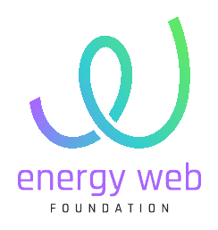
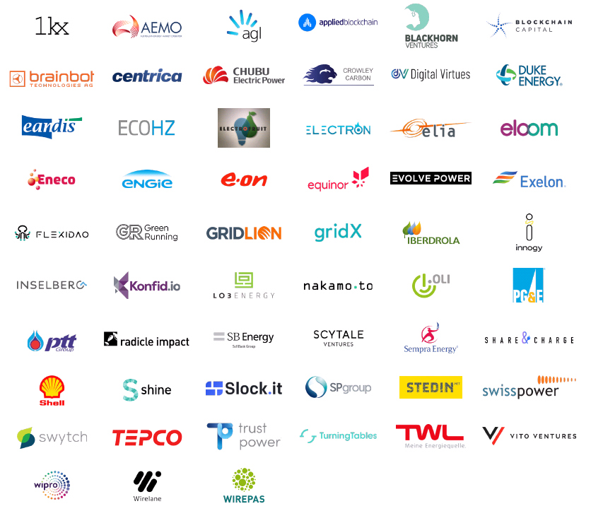
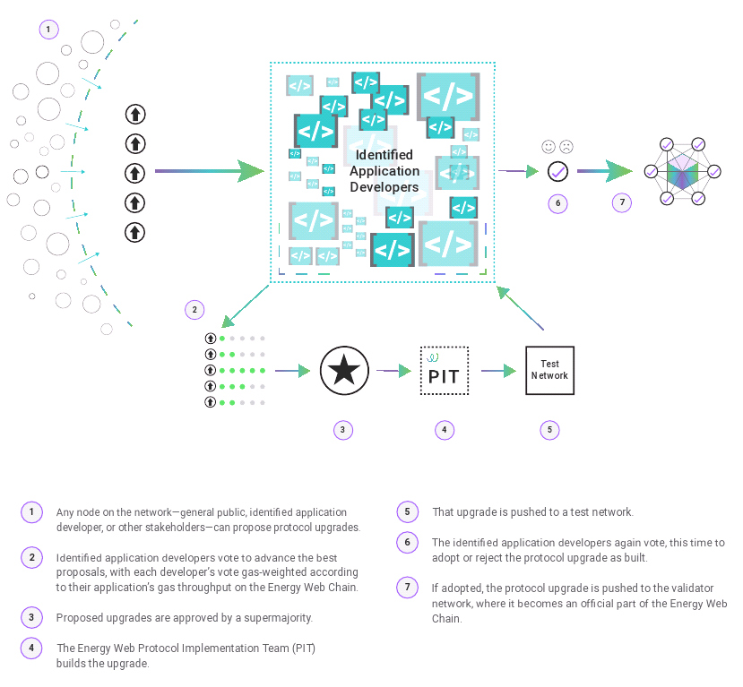
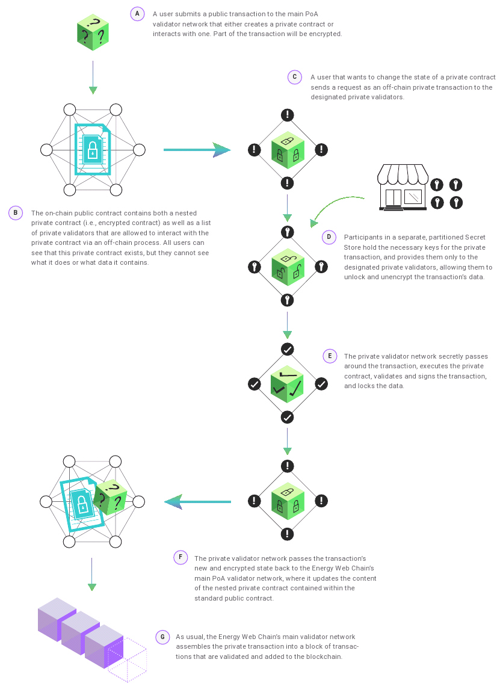
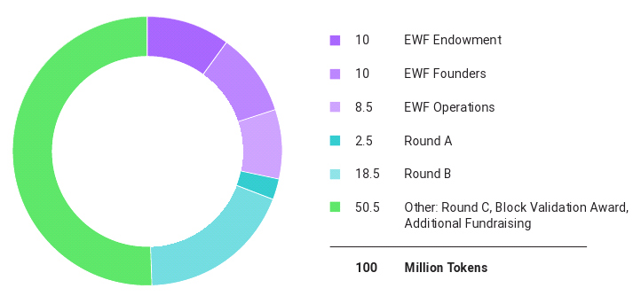
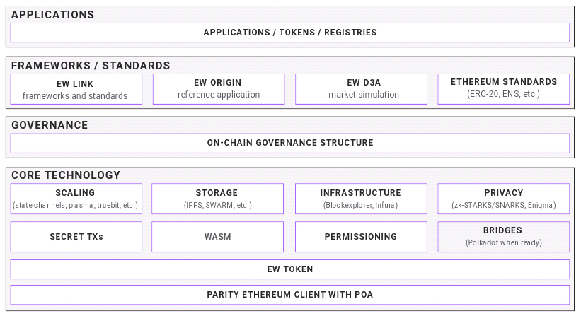

# The Energy Web Chain

> Accelerating the Energy Transition with an Open-Source, Decentralized Blockchain Platform 
Version 1.0 | October 2018

#### Contributors
*All contributors from EWF unless otherwise noted. Contributors listed alphabetically.*

Sam Hartnett, Claire Henly, Ewald Hesse, Thore Hildebrandt, Christoph Jentzch (Slock.it), Kai Krämer,
Garrett MacDonald, Jesse Morris, Hervé Touati, Ph.D., Ana Trbovich, Ph.D.

#### Acknowledgments
*The contributors also thank the following individuals for offering their insights and perspectives to this work.*

Peter Bronski (EWF), Aeron Buchanon, Ph.D. (Web3 Foundation), Dane Christensen, Ph.D. (U.S. National Renewable Energy Laboratory -
NREL), Stephen Comello, Ph.D. (Stanford University), Jon Creyts, Ph.D. (EWF / Rocky Mountain Institute - RMI), Dylan Cutler (U.S. National
Renewable Energy Laboratory - NREL), Paul Dezpraz (Slock.it), Adrien Gilles (Elia), Joanna Hubbard (Electron), Kevin Johnson (Pacific Gas
& Electric - PG&E), May Liew (Singapore Power), Rich Sedano (Regulatory Assistance Project - RAP), Dietrich Summerman (MotionWerk)

#### Suggested Citation
[*The Energy Web Chain: Accelerating the Energy Transition with an Open-Source, Decentralized Blockchain Platform.*](http://www.energyweb.org/papers/the-energy-web-chain) 
Energy Web Foundation, October 2018.

#### Copyright
Copyright 2018 Energy Web Foundation

#### About Energy Web Foundation
Energy Web Foundation (EWF) is a global nonprofit unleashing blockchain’s potential to accelerate the transition to a decentralized,
democratized, decarbonized, and resilient energy system. EWF is building the shared, digital infrastructure—an open-source, scalable
blockchain platform—specifically designed for the energy sector’s regulatory, operational, and market needs. Co-founded by Rocky
Mountain Institute and Grid Singularity, and with a worldwide network of more than 70 affiliates and growing, EWF is the largest energy
blockchain consortium and the industry’s leading choice as the foundational blockchain base layer, providing the digital DNA building
blocks powering the world’s energy future.

For more, visit [www.energyweb.org](http://www.energyweb.org).

#### Disclaimer
This is a living document. It is an ongoing mechanism to explain current and planned technical and governance features of the Energy Web
Chain (EW Chain), as well as to elicit feedback from energy market participants, regulators, and blockchain developers.

At the time of this publication (October 2018), the EW Chain is in the beta version of its test network; it should be considered an
experimental technology, not yet a commercial-grade solution. Numerous technical features remain in development and governance
design questions remain open. This paper’s intent is not to provide definitive answers, but rather describe EWF’s leading hypotheses and
approaches to development in order to encourage active collaboration with organizations at the nexus of blockchain and energy. We will
actively revise this document as we continue to gather input, test, develop, and iterate.

This is version 1.0.

#### Feedback
This document is a snapshot of our thinking at the time of writing; much remains to
be done. We welcome your input and feedback, so that we can continue to improve
our service to our Affiliates and the broader blockchain community.

**Please submit questions, comments and suggestions, revisions, etc. via Github:** 
https://github.com/energywebfoundation/paper

---

# Table of Contents
- [Executive Summary](#executive-summary)
- [Vision](#our-vision)
- [Principles](#our-principles)
- [Ecosystem](#our-ecosystem)
- [Frameworks](#our-frameworks)
- [Governance](#our-governance)
- [Technology](#our-technology)
- [Token-Secured Operating Model](#our-token-secured-operating-model)
- [Roadmap](#our-roadmap)
- [Appendix A: Glossary of Terms](#appendix-a)
- [Appendix B: EW Chain Technical Detail](#appendix-b)
- [Appendix C: EWF Important Actors](#appendix-c)
- [Appendix D: Preliminary Validator Node Guidelines](#appendix-d)

# Executive Summary
As a foundation building the open-source, blockchain-based, digital infrastructure for the energy sector, three core themes
define the Energy Web Foundation and our work:

**1. Community.** EWF has assembled over 70 energy and blockchain Affiliates, including several of the biggest energy players in
the world and many of the most successful innovators in the energy blockchain space. This community is growing
quickly and we strive to reach 200 participants by summer 2019. It is deliberately diverse geographically—
global in scope—and includes utilities, grid operators, renewable energy and cleantech companies, blockchain
developers, startups, and others.

**2. Technology.** EWF provides to the global community a blockchain-based software infrastructure: the Energy Web Chain. The
EW Chain, in its current instantiation, is a publicly-accessible test network with permissioned validators. It relies
on a Proof-of-Authority consensus mechanism, which provides 30x performance improvement and 2–3 orders
of magnitude lower energy consumption compared to Ethereum. In addition, EWF is continuously developing
software and hardware modules to lower the cost of application development and enable developers to focus
on their core differentiators. The EW Chain will launch in summer 2019 with a novel governance structure that
encourages further innovation. It is designed—both technically and in terms of governance—to be future-proof.

**3. Delivery.** EWF leverages the strengths of its co-founders, Rocky Mountain Institute (RMI) and Grid Singularity (GSy). RMI
has a proven track record in building energy-focused communities, with successful programs such as e-Lab and
the Business Renewables Center (BRC). Grid Singularity, recognized by the World Economic Forum as one of
the most innovative startups globally in 2018, provides—both directly or through its technology partners Parity
Technologies and Slock.it—EWF’s software and hardware delivery capabilities.

**We organized this document to allow you to have different levels of reading depending on the time you have available**

You can stop here—you already have the main points.  
You can read the summary of the key sections of this
document to go the next level of understanding.  
You can read the main body of the document to get further substance.  
We have also added a number of appendices in specific
topics if you want to deep dive in some of them.  

* **Our Vision: What do we hope to create in the energy sector by 2025?**  
    We aim to bring blockchain technology from “boutique”
    to “industry” in the energy sector, enabling pioneering
    market and business models that provide clear societal,
    environmental, and economic benefits.

* **Our Principles: What guides our work?**  
    To achieve our vision of widespread adoption of mass-market
    blockchain applications, we are following several principles:

    1. Focus on proving the value in one sector—energy,
    2. Form interdisciplinary teams of experts,
    3. Build a collaborative ecosystem with representatives
    from across the sector,
    4. Build frameworks and tools to accelerate
    commercial applications,
    5. Use innovative governance to balance the benefits
    of decentralization with regulatory oversight, and
    6. Provide open-source, publicly-available foundational
    technology that solves common developer needs.

* **Our Ecosystem: Who is involved? What is their role?**  
    We strongly believe that the value of blockchain is captured
    through active community participation and partnerships.
    Not only is our open-source technology development
    collaborative by nature, but the way we operate and bring
    together developers, regulators, and energy companies (our
    “ecosystem”) is collaborative by design.

* **Our Frameworks: What are we building? What is the status?**  
    Frameworks are publicly-available hardware and software
    components built on the EW Chain to accelerate application
    development. EWF has thus far built three initial versions:

    **1. EW Origin:** a reference application showing the
    transformative power of blockchain in renewable energy
    certificate and carbon accounting markets,  
    **2. EW Link:** a set of architectures and standards for
    securely connecting physical devices to the blockchain,
    enabling them to independently communicate and
    transact, and  
    **3. EW D3A:** a vision and simulation tool for localized,
    democratized electricity markets enabled by blockchain.  

    Moving forward, we will continue to develop these frameworks
    and add others based on input from the ecosystem.

* **Our Governance: What makes it unique? What are the benefits?**  
    The rules and processes for making decisions about how
    the EW Chain operates are crucially important; the network
    will interact with mission-critical energy infrastructure.
    Regulatory oversight is required not only to ensure that
    the EW Chain maintains the stability and safety of energy
    systems, but also protects consumer interests. At the
    same time, the global energy blockchain community must
    be empowered to influence the evolution of the network
    over time. The EW Chain governance structure has been
    designed to balance the benefits of decentralization with the
    oversight needed for regulatory acceptance.

* **Our Technology: What is our approach? What exists so far?**  
    The EW Chain is an open-source, publicly-accessible
    blockchain. It is derived from the Ethereum technology
    stack and currently deployed as a test network. It is
    designed specifically for energy-sector applications, using
    a Proof-of-Authority consensus mechanism to significantly
    increase transaction capacity and decrease energy
    consumption compared to the Ethereum mainnet and other
    public blockchains. The EW Chain supports new features
    such as private transactions and permissioning of smart
    contracts that make it possible to control data access for
    competitive and/or regulated energy market applications, in
    addition to providing technical solutions for secure, low-
    cost, and efficient integration with hardware (e.g., smart
    meters). More importantly, EWF has technical development
    capabilities and resources to continue to develop the EW
    Chain infrastructure to address the needs of the energy
    blockchain community, allowing developers to focus on
    moving their applications swiftly from “proof of concepts” to
    actual deployment in production environments at scale.

* **Our Roadmap: What are we working on next? When will we launch?**  
    We intend to launch the EW Chain in Q3 2019. In preparation
    for the launch, we will cultivate an active ecosystem of
    hundreds of Affiliates, test and refine the existing features
    on our testnet, build additional features, test and complete
    a functioning on-chain governance model, refine our three
    software frameworks, and launch additional frameworks and
    tools.

* **Our Token-secured Operating Model: Why is it needed? How does it work?**  
    As with most public blockchains, the EW Chain features a
    native first-layer utility token, the Energy Web Token (EWT).
    Native tokens, intrinsic to a platform’s protocol, serve two
    main purposes: security and validator compensation (via
    transaction fees and/or block validation awards). A total of
    100 million EWT are planned to operate the EW Chain.

# Our Vision
> What do we want to create in the energy sector by 2025?

Energy Web Foundation’s overarching objective is to
accelerate the global transition to a decentralized,
democratized, decarbonized, and digitalized resilient
energy system. We do this by unleashing blockchain’s
potential across the energy sector. To be certain, blockchain
technology is not a singular solution; it is one of many
tools that will influence the evolution of energy systems.
However, we believe blockchain has the potential to play a
critical role in transforming energy markets.

Below are three specific examples of how blockchains enable
our vision, followed by an explanation of the broader trends
made possible by introducing blockchain to the energy sector.

## Decarbonization: Community solar
Community solar was invented to provide renters and owners
of multi-family buildings a way to capture the benefits of
solar energy without installing solar panels on their own
roofs. A community solar project is normally a ground-
mounted solar installation, which tends to be cheaper per
installed kW than a rooftop installation and whose ownership
and benefits are shared by the community.

Soft costs—the costs of a project that come on top of
the actual equipment and installation, such as legal fees,
permitting, interconnection, administration, customer
acquisition costs—are proportionally higher for community
solar projects due to their complexity, often rendering these
projects cost prohibitive.

Blockchain technology can help reduce soft costs
considerably. Using smart contracts, a community can
establish partial asset ownership, governance, and profit
division so the entire process of owning one piece of an asset
is automatic, trusted, seamless, and much less costly.

The same goes on the revenue side. Currently, community
solar projects are constrained by geography. Using a
blockchain, production of the community solar project can be
shared via the chain for a global set of potential contributors
opening new and geographically diverse sources of revenue.
In addition, owners—participants in the project—can now
have liquidity; they can decide to sell the kWh they are entitled
to or even their shares in the project easily, electronically, with
no need for complex legal paperwork.

By reducing costs and unlocking additional sources of
revenue for community solar projects, blockchain can grow
this underutilized source of renewable electricity generation.
This approach could also be extended beyond community
solar to other renewable energy infrastructure, especially in
emerging economies where access to capital can be difficult.

## Decentralization: Re-architect the grid from the customer up
Today’s grid architecture—a largely one-way relationship
between grid operators and customers—is changing.
Customers are adopting distributed energy resources (i.e.,
smart, small, energy-producing or -consuming devices) at
unprecedented levels. Collectively, these devices could serve
the same function as centralized thermal power plants.
However, they are rarely used to their full potential since they
are naturally decentralized and distributed, making secure
digitization, coordination, control, tracking, and financial
settlement with each device expensive and oftentimes cyber-
insecure. Furthermore, the process of aggregating devices
into a single grid participant is difficult given the market
interests of each individual device manufacturer.

Blockchains could enable grid operators to overcome many
of these challenges, effectively re-architecting the grid from
the bottom up. Imagine being able to automatically connect
a new appliance or entire microgrid to a secure, decentralized
platform that incents devices—acting on behalf of their
owners—to use or not use electricity at certain times via
detailed, close-to-real-time price signals. Imagine renters or
homeowners participating in new electric markets by simply
setting their home to ‘economy mode,’ making their devices
available to grid operators and perhaps being paid to do so.

In a blockchain-based grid system, each distributed
energy resource would have a digital identity linked to its
corresponding information, such as capacity and consumer
preference. Using these identities, each device’s actions can
be transparently tracked on the blockchain, and revenues can
be divided and distributed automatically via smart contracts.

## Digitalization: Renewable energy certificate tracking
To respond to commercial interest and government
regulation, renewable energy certificates and guarantees
markets have emerged in the United States, Europe, Australia,
and elsewhere. While these markets have noble intentions,
their administration is highly manual and costly, rendering
the markets opaque, high-cost, and inaccessible for most
smaller participants. In addition, these analog, largely manual
markets are not able to support any higher-level functionality
such as consumption-linked purchasing, carbon-impact
selective purchasing, or renewable generator aggregation.

Why can’t buying renewable energy credits be like buying an
airline ticket–allowing buyers to search for exactly what they
want and allowing sellers to join forces to get a buyer to their
desired destination? Blockchains can create such a system
for renewable energy.

In a blockchain-based renewable energy credit market,
each asset would receive a digital identity that links to
all production of that asset and subsequently associates
with each owner of the credit. This record of identities and
ownership would reside on the blockchain for all market
participants to use. Smart contracts could then provide
automated additional functionality such as mapping kWh
production to carbon offset or automating credit purchasing
based on a consumption profile. In use cases where privacy
is needed, a device owner could cryptographically derive sub-
keys off-chain, so the identity of the owner of the device can
remain obfuscated.

By digitizing identities, records, ownership, and contracts,
blockchain can make renewable energy purchasing
transparent, highly functional, and low cost.

## Other examples
Beyond the three aforementioned examples, there are many
more ways that blockchain can create the value in the energy
sector. We will not go into the same level of detail or attempt
to be exhaustive with this list; consider it as a guide to what
future blockchains could enable.

*   **Expanded Market Access:** With blockchain-based
    applications, or smart contracts, automating many
    of the functions necessary to register, bid, settle, and
    generally participate in markets, blockchain can open
    markets to smaller participants. In electricity markets,
    residential households could allow their smart devices to
    bid into wholesale markets or whole households could
    aggregate with their neighbors to sign a direct power
    purchase agreement with a low-cost bulk supplier. Further,
    blockchain-based markets may enable more-rapid and
    efficient electrification in greenfield settings by enabling
    low-cost implementation of functions traditionally
    performed by utilities and grid operators.

*   **Greater Contract and Market Diversity:** Smart contracts
    can automate bilateral or multilateral contractual
    arrangements, allowing for a much greater diversity
    of contract types and market structures. Wholesale
    electricity market contract structures can be extended to
    the edge of the distribution grid and need not be limited
    by prohibitive back office costs. Forward-looking capacity,
    real-time energy, and ancillary services markets can be
    localized, aggregated in a nested hierarchy, and better
    reflect the value of energy and services over time and
    place. Automated dispatch, settlement, and reconciliation
    could enable many more contract types for both individual
    and aggregated distributed energy resources, making
    the market more diverse and “complete.” Unconventional
    business models will emerge for existing utilities and
    new market entrants as operating costs of market
    management continue to decline, the cost profiles of
    distributed and renewable resources continue to improve,
    and technological capabilities of blockchain and other
    digital technologies continue to expand. In an era where
    volumetric energy sales no longer grow revenue and the
    majority of value accrues in balancing services, “energy-
    as-a-service”—where consumers pay fixed subscription
    fees to retailers who in turn operate and monetize behind-
    the-meter assets—may become the norm.

*   **Improved Traceability:** Any digital object, whether
    representing a person, a physical asset, or an abstract
    concept like a carbon credit or avoided generation, can
    establish a unique and trusted digital identity. Over time,
    these identities establish robust digital records that
    track relationships with other identities, thus creating
    a common ledger for tracking ownership of assets and
    data. In carbon and renewable energy credit markets, this
    creates the potential to seamlessly trace credit ownership
    with drastically lower overhead and no risk of double
    counting. Utility customers and regulators alike can obtain
    increased information about the source and societal and
    environmental impacts of consumed energy. “Negawatts,”
    or energy savings, created by demand response and
    energy efficiency measures can be granularly and
    perpetually attributed to the appropriate asset or
    individual, providing utilities, regulators, and consumers
    with better information for making investment decisions
    and structuring program incentives.

*   **Direct Ownership:** Through automated smart contracts,
    blockchain makes it possible to raise financing for an
    asset that directly represents an ownership stake and
    right to partial profit at a level of granularity not possible
    or practical with other technologies. As the asset
    comes online and begins creating value, all owners are
    compensated directly and automatically. A tenant in an
    apartment building in New York, whose on-site solar
    PV and battery system is collectively owned by the
    equivalent of a real-estate investment trust composed
    of other tenants, can finance a specific panel on a solar
    PV installation in rural Tanzania, entitling them to a
    proportional share of revenue generated.

*   **Asset Agency:** For most of history, only people or
    organizations have had the capacity to conduct economic
    transactions. Through unique and trusted digital identities
    combined with software-driven “intelligence,” blockchain
    can enable physical assets to participate directly in
    markets without the need for a human intermediary.
    Each asset would have a unique identifier and record
    of transactions on chain. In electricity markets, electric
    vehicles could use this functionality to enter into direct
    legal agreements with counterparties, removing the need
    for a vehicle to re-enter a legal flexibility service agreement
    with a grid operator even if the human ownership of
    the car had changed. This is a powerful foundation for
    digitalized and distributed ownership, market participation,
    and wholly new profitable economic models.

*   **Data Sovereignty and Democratization:** By creating
    unique identifiers for asset owners, assets, and the data
    produced by those assets, blockchain can allow for
    direct data ownership and selective permissioning. The
    concept of personal data being “owned” and monetized by
    centralized service providers and the risk that such data is
    exposed through a breach of centralized servers is made
    obsolete. Users of blockchain networks and applications
    are empowered to control how their data is used and
    stored. Residential households could bid out their
    metering data anonymously to a range of retail providers
    to get the best retail rate, or sell their consumption profile
    to energy efficiency companies in exchange for the
    chance to offer goods and services. Not only could data
    ownership be tracked on a blockchain, but it could be
    enforced, with encryption protecting data owners from
    unwanted access and, where data is voluntarily shared,
    rights ownership ensuring only approved use.

## To learn more…
**...about the fundamentals of blockchain technology,**
take a look at the **Bitcoin** and **Ethereum** whitepapers,
the gentle introduction series from **Bits on Blocks**, and
many of the introductory articles on **MultiChain**.

**...about blockchain use cases in the energy sector,**
take a look at the many articles we and others have
published on the topic on the EWF **blog** and **news**
pages. In addition, we are working on a comprehensive
paper on the subject that will be released this winter.

**...about startups active in the blockchain and energy sectors,**
take a look at the startup **review** from the EWF-
sponsored event, EventHorizon.

# Our Principles
> What guides our work?

## Several principles guide our work in pursuit of our vision
*   **Focus on proving blockchain’s value in one sector: energy.**
    We recognize that we must intimately
    understand the problems facing a sector to scale up a
    new technology within it.

*   **Form interdisciplinary teams of experts from across
    the blockchain and energy sectors.** There are very few
    people who have expertise in both areas.

*   **Build a collaborative ecosystem with representatives
    from across the sector.** Our work will only create value
    in the energy sector if we have a large ecosystem of
    users and our technology will only improve if we offer
    that ecosystem extensive opportunities to collaborate
    with us and provide input.

*   **Build frameworks and tools to accelerate commercial
    applications.** Blockchain technology is at a very early
    stage and application developers need framework
    examples and standards to accelerate their application
    development.

*   **Use innovative governance to balance the benefits of
    decentralization with regulatory oversight.** In order to
    take over transactions in the heavily regulated energy
    sector, public blockchain governance must allow for
    regulatory oversight.

*   **Provide foundational technology that solves common
    developer problems and which is open-source and
    publicly-available.** The short blockchain history has
    shown that public networks foster more innovation than
    closed networks. We recognize that innovative solutions
    will come from many hands.

# Our Ecosystem
> Who is involved? What is their role?

In order to ensure that our work and technology is useful and appropriate for energy-sector blockchain applications, we have
been gathering and engaging an ecosystem of market participants and users to inform EW Chain development. We call them
**EWF Affiliates**.

EWF Affiliates are companies, large and small, who are playing an active role in informing the early development of the
EW Chain during its testnet phase (prior to the launch of the production network). We currently have an ecosystem of 70+
Affiliates ranging from the largest energy-sector market participants (including utilities, grid operators, and renewable energy
and cleantech developers) to the smallest blockchain and energy startups.

**Figure 1:** EWF Affiliates  
EWF has assembled a growing roster of more than 70 energy and blockchain Affiliates to date. Those logos shown here omit
those that have chosen to remain anonymous.

Many of our Affiliates are actively working on blockchain applications in the energy sector on topics ranging from electric vehicle
charging to demand response market settlement to certificates of origin tracking to peer-to-peer energy trading. To date we
have engaged this ecosystem to gather input into the development of our core technology, governance, and frameworks.

# Our Frameworks
> What are we building? What is the status?

Open-source frameworks (“frameworks”) are software
modules or reference applications that developers can use to
accelerate and reduce the costs of application development.

The art in framework development is to provide tools that
increase application developer productivity while leaving
enough space for competitive differentiation. It is analogous to
providing a Wifi or Bluetooth module that can be incorporated
into larger systems on chip designs. The modules themselves
(“frameworks” in our terminology) are not the base on which
developers will differentiate their product, but rather provide
important functionality that would have had to be developed
from scratch in the absence of the framework.

We use the term “framework” loosely at EWF. We mean not
only 1) open-source modules that can be used to develop
applications, but also 2) fully-fledged, open-source reference
applications that can be copied, modified, or simply used as
a reference to develop commercial applications. Below are
descriptions of three frameworks on which we have started
development work that fall in one or the other category.

## EW Origin: a reference application for the exchange of renewable energy certificates / certificates of origin (RECs / COs)
EW Origin provides an end-to-end standard and set of
developer tools for renewable energy producers and
consumers to commercially exchange the “green attributes”
of renewable generation using a trusted, transparent, and
low-cost approach.

EW Origin is protected by an open-source software license. [\[1\]](#citeref1)
Using the alpha version of the EW Origin application
Microsoft, E.ON, SP Group, Engie, and others have executed
demonstrations of certificate exchanges in several markets
across the world.

*Learn more about the EW Origin reference application by: a) **reading
more on the EWF website**, b) watching a **demo** from EventHorizon
2018, c) watching an **overview video**, and d) reviewing the open-source
codebase on **Github**.*

## EW Link: a set of reference architectures to bridge the physical and digital worlds
EW Link is a set of reference architectures for connecting
physical devices and off-chain systems with the EW Chain
so they can communicate and transact on the blockchain in
a low-cost, secure, and reliable way. One example—already
deployed—is an EW light client on a simple IoT device
(the Artik 7) to facilitate communication with utility-grade
electricity generation meters.

*Learn more about the Artik 7 demonstration by watching the **demo**
from EventHorizon 2018.*

Moving forward, EW Link will deliver frameworks and
reference implementations to support application
developers as they connect to the relevant devices for their
applications. All EW Link work will be released to the EWF
developer community open-source.

## EW D3A: a vision and structure for recursive, decentralized electricity markets
To support a future vision of electricity markets, we have
designed a model called the Decentralized Autonomous
Area Agent (D3A). In this market model, any energy-
consuming or -producing device can collaboratively transact
with other devices in its local area in order to optimize
operational decisions locally—based on user preferences
and system conditions—with canonical data and
communications up and down the value chain. This model
can apply at the level of a house, a neighborhood block, a
distribution feeder, or an entire distribution network.

While the full suite of technologies required to realize this
decentralized electricity market, including the blockchain
components, are not production-ready, the EW D3A
team has built a free software simulation environment
to demonstrate the economic impact of a decentralized
market model in a variety of grid configurations. In fact,
EWF Affiliate Stedin, one of The Netherlands’ grid operators,
and partners are already piloting a similar blockchain-based
solution they call the **Layered Energy System**. Like the
EW D3A, smart devices across a neighborhood of houses
collaborate at the local level first to balance electricity
supply and demand, before turning more widely to the grid
to buy and sell energy and grid services.

*Learn about the D3A decentralized market model rationale by reading
our April 2018 **concept brief** and about the alpha version of the
simulation environment by watching a **demo** from EventHorizon 2018.*

---

**\[1\]** *Origin consists of three distinct parts: 1) an asset and user registry,
2) a national registry, and 3) marketplace features such as matching algorithms
to match supply and demand. Parts 1 and 2 are to be released under GPLv3 copyleft,
while part 3’s licensing structure is still under development. The
intent is to enable Affiliates to adapt and offer commercial products if desired.*

# Our Governance
> What makes it unique? What are the benefits?

True blockchains are used by many and owned by none.
Therefore, one of the most critical design considerations
when establishing a new blockchain infrastructure is
its governance mechanism. How are changes to the
blockchain’s protocols designed and implemented? In other
words, how does the chain actually work and evolve over
time, especially as a founding organization such as EWF pulls
back from its initial oversight and stewardship and divests
more control to the community?

## In this section, we address four major topics related to governance of the EW Chain
1.  What are the design objectives of EW Chain governance?
2.  What design principles did we follow?
3.  How does EW Chain governance work in practice?
4.  How does EW Chain governance differ from other
    blockchains and what are its benefits?

## 1. What are the design objectives of EW Chain governance?
Energy Web Chain governance should ensure that the
EW Chain is:

*   **Inclusive:** open to energy blockchain applications and
    supportive of their widespread use
*   **Transparent:** open to examination by regulators,
    developers, and market participants
*   **Secure:** able to resist distributed attack vectors and to
    protect privacy
*   **Responsive:** able to take action quickly when needed
*   **Adaptable:** able to improve with technology, adjust to
    evolving needs, and react to threats
*   **Cost-effective:** able to maintain competitive
    transaction costs
*   **Scalable:** able to support industrial applications at scale,
    not just proofs of concept

## 2. What design principles did we follow?
We use the following principles in designing EW
Chain governance:

*   **Transparency on governing parties:** Entities participating
    in Energy Web Chain governance are identified to facilitate
    market oversight by regulators.

*   **Governance by “gas”:** Application developers are given the
    leading role to govern the EW Chain. Their voting rights
    are determined by how useful their applications are. We
    measure applications’ usefulness via proxy as measured
    by the computing processing power (i.e., “gas”) from
    applications deployed from their known addresses on
    the blockchain. In other words, more-useful applications
    that are more-widely used by the broader community will
    “spend” more gas, giving those applications’ developers
    stronger voting rights.

    We fully recognize this system is not without limitations
    and drawbacks. It creates potential issues and incentives
    to spend unnecessary gas in order to accrue voting rights.
    However, we are convinced that developers—rather than
    network validators or token holders—are the appropriate
    constituency to delegate voting power to. We are currently
    experimenting with several mechanisms to prevent
    potential abuse, including a floor on voting power (i.e.,
    each developer is guaranteed a minimum share), a cap
    on voting power (i.e., individual developers are limited at
    a certain threshold), and a rigorous know-your-customer
    (KYC) process to create legal and reputational deterrents
    to malicious behavior.

*   **“Common carrier”:** The EW Chain should provide
    equal and non-discriminatory access to all application
    developers.

*   **Conflicts of interest:** Application developers remain
    responsible for regulatory and legal compliance of their
    applications and cannot use their influence in the EW
    Chain governance body to generate an undue advantage
    for themselves, their applications, or their customers.

*   **Mix of on-chain and off-chain governance:** We use
    on-chain governance mechanisms when possible (i.e.,
    established in software code), complemented by off-chain
    governance mechanisms (i.e., managed by people under a
    set of established rules) when the situation is too complex
    or generally ill-adapted to software-based resolution.

## 3. How does EW Chain governance work in practice?
The Energy Web Chain protocol can be changed by
agreement among identified actors (approved application
developers) using the steps outlined in Figure 2. Additional
details on the different actors in the EWF governance model
are provided in Appendix C.

The goal of the governance model is to ensure that the EW
Chain remains secure, cost-effective, and useful over time by
adopting the most helpful technology upgrades and aligning
the community around the direction of the EW Chain.

EWF will initially set all processes and criteria described
herein prior to the EW Chain’s genesis block and enshrine
them in code on-chain. Post-genesis block, all processes and
criteria are subject to change via the governance model.

**Figure 2:** The Energy Web’s Process for Protocol Upgrades with On- and Off-Chain Governance  
Approved developers govern the EW Chain through gas-weighted voting on proposed protocol upgrades, after which “winning”
upgrades are built, tested, and officially adopted or rejected.

**Step 1. All stakeholders can propose protocol upgrades.**
Energy Web Chain protocol recommendations and upgrades
can be submitted by the general public, the various EWF
bodies, or approved developers. Nobody has a monopoly
on good ideas. The Energy Web Protocol Implementation
Team (PIT) facilitates an open, structured, and transparent
process in order for the highest-potential innovations, ideas,
and specific proposals from the EWF ecosystem to be
considered for adoption. Future publications of this paper
will describe additional tools the PIT may use to channel
such ideas from the greater EWF ecosystem.

**Step 2. Developers identify themselves in order to receive
voting privileges and vote to advance the most popular
proposals.** Any developer may run smart contracts on the
network, but only developers that complete a KYC process
(initially set by EWF [\[2\]](#citeref2)) to publicly identify themselves may
participate in the governance process that decides on protocol
upgrades. A separate implementing body, the EWF Identity
Verification Team (IVT), administers the process, reporting on
any action taken. This KYC process intends to deter misuse of
voting rights and maximize incentives for developers to act in
the EW Chain’s best interest. [\[3\]](#citeref3)

Crucially, identified application developers are the only parties
eligible to vote on protocol upgrades. [\[4\]](#citeref4) EWF will set an initial
voting procedure, process, and approval threshold with input
from the community followed by rigorous testing. These votes
are weighted by transaction throughput on applications as
measured by gas spending, up to a determined cap.

**Step 3. Proposed upgrades are approved by a supermajority.**
The threshold will be set after further calculations and testing
to ensure efficiency while safeguarding community interests.

**Step 4. The Energy Web Protocol Implementation Team (PIT)
builds the proposed protocol.** The PIT is an implementation
team (likely employed by EWF) composed of technical,
regulatory, and energy-sector experts. The PIT is responsible
for implementing general protocol upgrades approved by
the identified application developers in Step 3 by coding and
testing protocol specifications, managing the protocol roll-out
process, and reporting. [\[5\]](#citeref5)

**Step 5. The PIT posts the upgrade to the test network.**

**Step 6. After testing, the identified application developers
vote whether to adopt the new protocol.** EWF will set
an initial duration for test phases, during which protocol
changes developed in Step 4 are released on the EWF test
network. During the test phase of the network, all users and
developers in the EW Chain community have the opportunity
to review and experiment with the new protocol. At the end
of the test phase, identified application developers vote
whether to deploy the new protocol to the main EW Chain.

**Step 7. EW Chain validator nodes adopt the protocol
change.** Validator nodes will automatically upgrade protocols
to reflect votes and decisions taken by the identified
application developers in Step 6. EWF initially sets eligibility
requirements and an authorization procedure for validators.
Once set, such requirements and criteria will live on the
platform and are subject to change via the governance
process. The EWF Identity Verification Team administers the
process following up with reports on any actions taken.

Emergency upgrades are expedited. Emergency protocol
upgrades are similar to other protocol upgrades except for
their level of urgency. The PIT scans for and is alerted to urgent
issues that compromise the safety or stability of the network.
PIT may submit emergency protocol upgrades directly to the
Energy Web test network (in effect, expedite Steps 1–5) and
call on the identified application developers to vote for the new
protocol.

## 4. How does EW Chain governance differ from other blockchains and what are its benefits?
In contrast to other blockchains that put the leading role
to change the network into the hands of miners or token
holders, the EW Chain empowers developers who create
the most-useful applications and smart contracts for users.
The main advantage of our approach is that it is more likely
to stimulate continuous improvement and adaptation to
future needs—and should be sufficient protection against
excessive transaction prices.

One potential weakness of our governance approach would
be the possibility of one party to block a decision that it
does not support, for any reason. We minimize that risk by
allowing voting only by developers who have successfully
completed an identification process and by dynamically
ensuring minimum and capping maximum voting rights
of any identified party based on an empirical formula. We
are currently experimenting with different formulas and
evaluating a wide range of scenarios in order to develop
a cap that appropriately mitigates risk of abuse while still
providing an incentive to develop useful contracts. 

---

**\[2\]** *As with other governance and validator authorization processes, exact procedures are not defined at time of this publication. We intend to be transparent about
our current approach in hopes of eliciting feedback from the EWF ecosystem. Details will be published in subsequent versions of this paper.* 

**\[3\]** *Since developers are publicly-known, undesirable behavior both on-chain (for example, intentionally attempting to disrupt the network via extreme volumes of
transactions or malicious contracts) and off-chain (criminal conviction) could be grounds for remedial action, including de-authorization. The power to revoke
voting privileges is an obvious candidate for potential abuse by malevolent actors, but given regulatory and market realities in the energy sector it may be
appropriate to implement in some form. We do not have specific plans to implement a de-authorization process as of the time of this publication. We raise the
issue for consideration.* 

**\[4\]** *Note: EWF may engage a game theory expert to define the threshold that will provide robust sustainability (i.e., to enable the network to move forward but
disable a malicious actor from either implementing a negative change or blocking a positive change).* 

**\[5\]** *Exact details are not final at the time of publication. Our vision is that the cap size is dynamic, based on the number of approved developers and amount of gas
spent over a specific time period, and the formula is designed to prevent a small number of approved developers from dominating the system while providing
sufficient voting power to the most-used applications. Additional details will be published in forthcoming governance documentation.* 

# Our Technology
> What is our approach? What exists so far?

From EWF’s inception, we chose to derive our tailored-to-
the-sector blockchain technology from an existing one (i.e.,
Ethereum), versus developing our blockchain technology from
scratch. That allows us not to spend resources reinventing
the wheel but rather focus our software development effort
on functionalities that address the specific pain points of
application developers in the energy sector.

## In this section, we address major questions about our technology:
1. Why use Ethereum as a starting point?
2. What technical capabilities does EWF have to make
   competent changes to Ethereum?
3. How does EWF select which adjustments to make
   to Ethereum?
4. What adjustments has EWF made so far?
5. What tools and solutions currently exist for developers
   using the EW Chain?

## 1. Why use Ethereum as a starting point?
We decided to use Ethereum as a starting point for our
technology for the following reasons:
*   Open-source: It was important for us to use open-source
    technology as we wanted to have EWF technology likewise
    be open-source from the beginning.
*   Public: It was also important for us to rely on a public
    blockchain technology as many of our envisioned
    applications require a public chain.
*   Robust: Robustness was another reason why we opted for
    a public chain. Public chains are more exposed to attacks.
    Public chains that have survived public scrutiny are more
    likely to be resilient than private chains. Ethereum is a
    public chain that was released in 2015 and has survived
    several years of public testing. Ethereum mainnet today
    processes **up to 1,300,000 transactions per day**—more
    than the number of transactions processed by all other
    public blockchains combined (excluding Ripple).
*   Flexible: We needed a technology that would allow for a
    large diversity of applications. Ethereum’s key innovation
    was the Ethereum Virtual Machine (EVM), which is
    technically Turing complete, and can therefore support any
    kind of algorithm or application.
*   Popular: Ethereum has a large developer community and
    many available open-source extensions. A technology with
    a strong existing developer community was also important
    to us as it would allow us to leverage existing skills and
    knowledge. Ethereum has the **most-robust, fastest-growing
    developer community** in the public blockchain space, with
    more Github repositories, developers, and code updates
    **than any other open-source blockchain**. Ethereum supports
    thousands of applications. Many functionalities that would
    be needed for energy applications can be derived from open-
    source modules developed by the Ethereum community.

**To be clear: the EW Chain is not Ethereum.** It is derived
from the Ethereum code base, but is a different technology
stack and a different chain, with a growing number of
functionalities designed to meet the specific needs of
blockchain applications in the energy sector.

## 2. What technical capabilities does EWF have to make competent changes to Ethereum?
EWF partnered with Grid Singularity, Parity Technologies,
and Slock.it for Ethereum expertise. Parity Technologies is
a leading developer of peer-to-peer computing systems and
decentralized consensus architectures. Parity was founded
and is led by Gavin Wood, the chief developer of Ethereum.
The Energy Web Chain uses Parity Technologies’s Ethereum
client as a starting point.

EWF has also partnered with Slock.it, one of the foremost
developers of Internet-of-Things (IoT) and blockchain
technology to add IoT-related functionalities to the EW Chain.
Slock.it was founded and is led by Christoph Jentzsch, one of
the core developers of Ethereum.

EWF has also hired a small team of core technology
developers from the market. They work in close collaboration
with Parity Technologies and Slock.it.

## 3. How does EWF select which adjustments to make to Ethereum?
EWF focuses on technology that addresses the most-
common challenges blockchain application developers face
in the energy sector.

To determine which functionalities to provide, EWF remains
in frequent contact with Affiliates and other ecosystem
participants to understand pain points. We then prioritize
based on perceived importance and easiness to address.

Our technical team acts as a first filter, leveraging or
adapting existing solutions when possible. If that is not
sufficient, our team engages our technology partners to
develop the required solutions. Depending on the difficulty
of the challenge, that phase may require some research
and development. In other words, some technology
enhancements may be straightforward to implement and
require a few days of work. Others are difficult problems to
solve—like introducing parallelism in blockchain—and may
require a multi-year effort involving significant innovation.

## 4. What adjustments has EWF made so far?
In the April 2018 beta release of Tobalaba, our test network, we have have addressed the five most-important “pain points”
identified so far by the application developers in our ecosystem. Table 1 provides a high-level description of these five pain
points, together with the adjustments we have made to Ethereum to address them.

**Table 1:** Energy Web Chain Customizations to Ethereum

<table>
<thead>
<tr>
<th align="left">Pain Point</th>
<th align="left">Adjustment made to Ethereum</th>
</tr>
</thead>
<tbody>
<tr valign="top">
<td align="left"><strong>Low network capacity:</strong> Due to the way blocks are created, transaction demand often exceeds available computational supply (i.e., there are too many transactions to fit in a given block), resulting in high transaction costs, delayed settlement, and limited scalability for mass-market applications.</td>
<td align="left"><strong>Proof-of-Authority consensus:</strong> EWF replaced the Proof-of-Work (PoW) consensus mechanism used in Ethereum with a Proof-of-Authority (PoA) consensus mechanism. That change increased network capacity by 30x compared to Ethereum.</td>
</tr>
<tr valign="top">
<td align="left"><strong>Expensive IoT integration:</strong> Large software “clients” cannot be integrated into small devices because of insufficient memory storage and computing power capacity, limiting the applicability of blockchain in IoT.</td>
<td align="left"><strong>Light client:</strong> EWF provides different versions of light clients adapted to various types of IoT devices, enabling the connection of distributed energy resources to the EW Chain.</td>
</tr>
<tr valign="top">
<td align="left"><strong>No differentiation between nodes in the network:</strong> The inability to differentiate between nodes and accounts from a rights and obligations perspective restricts higher-level governance and application functionality.</td>
<td align="left"><strong>Permissioning:</strong> EWF provides the technical capability to differentiate between nodes based on governance, applications, and regulatory requirements, all while keeping the chain public.</td>
</tr>
<tr valign="top">
<td align="left"><strong>Low privacy:</strong> Little to no ability to execute private transactions limits the ability to develop applications in markets where data privacy is required (e.g., residential customer data, wholesale market transactions).</td>
<td align="left"><strong>Private Transactions:</strong> EWF provides a mechanism to allow developers to maintain data privacy while keeping the validation benefits of a blockchain.</td>
</tr>
<tr valign="top">
<td align="left"><strong>Development limitations:</strong> The Ethereum Virtual Machine (EVM) is relatively slow and expensive compared to other code-execution engines. To write contracts for the EVM, developers must use bespoke programming languages (predominantly Solidity) that are less secure and more limited in functionality compared to other languages with longer histories and broader uses.</td>
<td align="left"><strong>WASM:</strong> EWF provides access to a Web Assembly (WASM) virtual machine on top of the Ethereum Virtual Machine, which has a benefit of faster execution (initial data suggest <strong>1.3x</strong> to <strong>15x</strong> improvement in execution speed, in addition to reduced CPU usage for validators) compared to the EVM. This has the additional benefit of providing access to additional programming languages beyond Solidity and more-robust developer toolkits for auditing and debugging code.</td>
</tr>
</tbody>
</table>

The rest of this section covers each of these adjustments in
greater technical detail.

**Proof-of-Authority Consensus:** *improved functionality and
increased technical capability for regulatory oversight while
maintaining network trust and security*

Consensus is at the core of blockchain technology. It
is the mechanism that establishes agreement among
decentralized validator nodes and the trust from the users in
the data that is propagated throughout the network.

The key criteria for a consensus mechanism compatible
with the energy sector are: a) high capacity, b) security, c)
resource efficiency, d) regulatability, and e) fidelity.

We are using a Proof-of-Authority consensus mechanism [\[6\]](#citeref6)
for the Energy Web Chain, in which a pool of known and
trusted computers—called validator nodes—are responsible
for validating transactions and creating blocks. This
approach offers certain security, regulatory transparency,
and considerable capacity benefits, though it does sacrifice
a small but not insignificant level of decentralization.

---

**\[6\]** *Proof-of-Authority and PoA refer to the Aura consensus algorithm unless otherwise specified. While we are using Aura PoA on the Tobalaba test
network at the moment, we will adopt best-practice PoA mechanisms as the technology advances.
To learn more, visit https://wiki.parity.io/Proof-of-Authority-Chains.*

**Figure 3:** The Energy Web’s Proof-of-Authority (PoA) Consensus Mechanism

By limiting the ability to create blocks to a known pool of validators, we can achieve the following benefits without sacrificing
the integrity of the chain:

**Table 2:** Proof-of-Authority Consensus Mechanism Benefits

<table>
<thead>
<tr>
<th align="left">Benefit</th>
<th align="left">Explanation</th>
</tr>
</thead>
<tbody>
<tr valign="top">
<td align="left"><strong>More consistent and predictable time and state finality</strong></td>
<td align="left" rowspan="3">The combination of limiting validator status to a defined number of
nodes who have passed a vetting process (for details see Appendix D)
and establishing economic and reputational incentives (validators have
something at stake) introduces an inherent level of trust between the
participants. Since there is no competition among validators to race each
other to create blocks, transaction throughput can be increased (faster
block time) while energy consumption and computational complexity is
drastically reduced (compared to Proof-of-Work).
</td>
</tr>
<tr valign="top">
<td align="left"><strong>Significantly improved resource efficiency (i.e., lower energy consumption)</strong></td>
<td align="left"></td>
</tr>
<tr valign="top">
<td align="left"><strong>Increased throughput</strong></td>
<td align="left"></td>
</tr>
<tr valign="top">
<td align="left"><strong>Reduced transaction costs</strong></td>
<td align="left">The reduced computing and energy requirements in turn reduce
the operating cost for validators. In combination with the increased
throughput and hence a higher supply, transaction costs are drastically
lower compared to Ethereum. Given that throughput capacity on the
EW Chain is one order of magnitude greater than Ethereum, we expect a
corresponding decrease in transaction costs.
</td>
</tr>
<tr valign="top">
<td align="left"><strong>Minimal network latency</strong></td>
<td align="left">Validator nodes in the EW Chain are typically run on dedicated hardware in
professional server environments with high-speed Internet connections.
</td>
</tr>
<tr valign="top">
<td align="left"><strong>Simplified protocol upgrades</strong></td>
<td align="left">Limiting validator status to known and legally registered entities simplifies
the process for rolling out upgrades to the core protocol (coordinating a
vetted group of validators with aligned incentives is easier than a dynamic
group of anonymous miners).
</td>
</tr>
<tr valign="top">
<td align="left"><strong>Enhanced security</strong></td>
<td align="left">EWF provides access to a Web Assembly (WASM) virtual machine on top
of the Ethereum Virtual Machine, which has a benefit of faster execution
(initial data suggest 1.3x to 15x improvement in execution speed, in
addition to reduced CPU usage for validators) compared to the EVM. This
has the additional benefit of providing access to additional programming
languages beyond Solidity and more-robust developer toolkits for auditing
and debugging code.
</td>
</tr>
</tbody>
</table>

We are aware, as well, of the limitations and risks of adopting a Proof-of-Authority consensus and are adopting the following
mitigation strategies. While these are our current hypotheses, EWF will continue to test and develop new solutions over the next year.

**Table 3:** Risks and Mitigation Measures to a Proof-of-Authority Approach

<table>
<thead>
<tr>
<th align="left">Risk</th>
<th align="left">Description</th>
<th align="left">Mitigation</th>
</tr>
</thead>
<tbody>
<tr valign="top">
<td align="left"><strong>Centralization</strong></td>
<td align="left">A common criticism of PoA is that it is
not truly decentralized. By definition,
introducing a gatekeeper for validators
requires oversight by some kind of central
entity. And if the validator pool is not
sufficiently large and diverse, the risk of
51% or distributed denial-of-service (DDoS)
attack vectors is substantial.
</td>
<td align="left">EWF’s approach to mitigating this risk is
threefold:
<ol>
   <li>We are fully transparent with the initial
   selection criteria (see Appendix D) for
   becoming a validator.</li>
   <li>EWF will relinquish control over the
   selection criteria post-genesis block; the
   power to amend the validator requirements
   will be transferred to approved developers
   on the EW Chain with special voting
   privileges (see Governance section and
   Appendix B).</li>
   <li>EWF will actively seek entities from the
   government, private, and not-for-profit
   sectors to establish validator nodes over
   the next year, with a minimum goal of 100
   nodes diversified over a minimum of four
   continents by 2019.</li>
</ol>
</td>
</tr>
<tr valign="top">
<td align="left"><strong>Synchronization</strong></td>
<td align="left">PoA relies heavily on timestamp accuracy
and synchronization compared to PoW. There
is a risk of inadvertent forks if timestamps
on validators become out of sync, competing
blocks are created simultaneously,
and adversaries potentially manipulate
timestamps on validator hardware to disrupt
the network.
</td>
<td align="left">To mitigate this risk, EWF has established
validator node security and hardware
guidelines (Appendix D), which prescribe
functional requirements for client
implementation. Outside of a few isolated
incidents, synchronization has not emerged
as an issue on Tobalaba to date, due in large
part to the fact that validators are run on
professional servers in secure environments.9
EWF will continue to identify specific
potential attack vectors for validator nodes,
update the client as necessary, and publish
mitigation techniques.
</td>
</tr>
<tr valign="top">
<td align="left"><strong>Predictability</strong></td>
<td align="left">Current implementations of PoA have a
highly predictable validation schedule, which
offers throughput benefits but potentially
opens the door for targeted attack vectors.
</td>
<td align="left">One approach to reducing the predictability
of the block validation schedule would be
to adopt a non-deterministic PoA algorithm
that randomly, but with equal probability,
selects primary nodes from the pool of
validators. This would increase the difficulty
of a coordinated attack (DDoS or other)
on validators as they are called to validate
blocks. Another potential solution is to
optimize the number of validators to balance
susceptibility to targeted attack with cost
of maintaining the network (i.e., increasing
the total number to sufficiently mitigate
predictability without incurring unnecessary
costs). We are currently in the process
of evaluating these, and other, mitigation
strategies for selection.
</td>
</tr>
</tbody>
</table>

Validator nodes in the Tobalaba test network are limited
to **EWF Affiliates**. They are legally registered entities who
participate in energy markets globally, ranging from energy
companies and other large corporations, to utilities and grid
operators, to recently founded startups. [\[7\]](#citeref7) For successful
operation, the EW Chain must cultivate a pool of validator
nodes that is sufficiently diverse in terms of organizational
structure and geography to maintain the benefits of a
decentralized network. Crucially, once the EW Chain is
launched, validator nodes will no longer be restricted to
EWF Affiliates (draft validator node requirements for the
production EW Chain are described in Appendix D).

**At a high level, the PoA mechanism works as follows
(also see Figure 3):**

*   All validator nodes maintain a **complete list of the
    validators**, identified by public keys. This list changes
    as validators are added or removed. [\[8\]](#citeref8) In addition to
    storing the current and historical state of the network,
    all validators maintain essential information about the
    network (such as synchronized timing information and
    current data processing limits).
*   For a defined time window, one validator is assigned as
    the primary validator via the PoA algorithm, responsible for
    collecting the broadcasted transactions and proposing the
    new block. Only one validator is designated as primary at a
    time–based on a calculation derived from the timestamp
    on synchronized clocks among the validator nodes in the
    network and the number of validators–in order to prevent
    validators from arbitrarily creating blocks at irregular intervals.
*   If a validator fails to create a block when it is selected
    (e.g., because of hardware problems on the side of the
    validator) or its block fails to be validated by the pool of
    nodes (e.g., because of network connectivity problems),
    the next validator proceeds to create a block with
    whatever transactions haven’t been processed.
*   The remaining validator nodes verify that the transactions
    in each block are legitimate for that time window, sign the
    block with their private keys, and propagate the signed
    block to the network.
*   Once a simple majority of validators have authored a
    block on top of a given signed block, finality is achieved
    for that given block, and the block is confirmed by the
    network and added to the EW Chain.

**The Light Client:** *shrinking the size of the client to facilitate
connecting IoT devices and distributed energy resources to the
EW Chain* [\[10\]](#citeref10)

Low-powered devices, ranging from smartphones to smart
meters, represent a large class of devices that can interact with
the EW Chain. It is essential for these resource-constrained
devices to have full access to the network without having
to store and maintain a copy of the entire, multi-gigabyte
blockchain. Simultaneously, interacting with the blockchain
should not compromise the security of these devices.

The EW light client stores a “light” version of the entire
blockchain on these devices and provides a protocol to
request additional data from the network as needed at a
level of security on par with validator nodes. The light version
of the EW Chain includes block headers and relevant state
variables, enabling a similar level of trustless knowledge
and usability as full nodes while only storing a tiny fraction
of blockchain data. The EW light client extends Parity
Technology’s reference light client by allowing it to work with
PoA consensus. We are investigating other client and device
interfaces, some lighter than others, with lesser storage
requirements of the current light client.

**Permissioning:** *providing the technical capability to differentiate
between nodes and accounts based on governance, applications,
and regulatory requirements* [\[11\]](#citeref11)

In order to balance the openness of the blockchain network
with regulatory compliance, grid operational needs, and other
variables, we need some form of permissioning mechanism
to grant differing privileges to varying actors.

Permissioning is most relevant to the EW Chain protocol and
governance model. At the protocol layer, permissioning enables
a governing body (i.e., the EWF Foundation Council initially,
and subsequently, the Application Operator Governance Body)
to establish specific criteria that determine the list of validator
nodes with the ability to create blocks, and thus define a
network boundary by permissioning those specific nodes.

In the EW Chain governance mechanism, permissioning
similarly grants privileges (voting rights in this case) only to
specific developers who have completed a KYC process to
identify themselves to the network. Thus, permissioning allows
specific user accounts to interact with voting contracts that
influence modifications to the EW Chain protocol.

At the application layer, permissioning can grant privileges
to specific users or smart contracts to conduct particular
transactions (e.g., transfer tokens or deploy new smart
contracts). For example, by combining a KYC process
to identify specific individuals and grid assets with a
permissioned smart contract, a solar farm physically located
in Australia could be prevented from offering generation
capacity and energy for a North American utility service
territory but allowed to sell renewable energy credits in a
global market. Importantly, this type of permissioning is
implemented by developers of smart contracts working in
concert with relevant utilities and regulators and requires
sufficient information and processes to verify the relationship
between EW Chain accounts and physical assets.

---

**\[7\]** *Governmental and regulatory organizations are also invited to run Validator nodes.* 

**\[8\]** *In the production EW Chain, the process for adding and removing validators will be embedded in on- and off-chain governance protocols.* 

**\[9\]** *For full validator node security recommendations see Appendix D. While EWF strongly recommends these security recommendations we cannot require them.* 

**\[10\]** *To learn more about how light clients work, visit: wiki.parity.io/Light-Ethereum-Subprotocol-(LES).* 

**\[11\]** *To understand how permissioning works in detail, visit: https://wiki.parity.io/Permissioning or **Permissioning** on EWF’s Wiki.* 

**Private Transactions:** *allowing application developers to
maintain mandated customer privacy* [\[12\]](#citeref12)

One of the defining features of a public blockchain is its
transparency. Anyone can read and verify data (albeit
pseudonymized via hashing) contained within blocks.
Transparency is a feature, not a bug, but this trait is not
always desirable. To comply with confidentiality regulations
or desire of market participants to avoid making certain
data like transaction prices and volumes public, the EW
Chain needs the ability to hide sensitive information on the
platform. Private transactions address this by introducing
smart contracts with encrypted code and state data, where
strict controls are enforced as to who may access, alter, and
validate data contained within.

**Private transactions work as follows (also see Figure 4):**
*   A public smart contract contains a nested private
    contract to encrypt state and code data; it also
    establishes a list (subset) of validators for the private
    transaction (note: this group of validators is separate
    from the general validator pool of the main chain).
*   The only way to access the encrypted data is with a
    unique key. The key is partitioned among a subset of
    nodes, called Secret Store, whose purpose is to generate
    and store keys. A separate Registry Contract grants
    permissions to specific addresses (i.e., users) to access
    the encrypted private contract by requesting the key
    elements from the Secret Store to decrypt the data.
*   After decrypting the data, the recipient sends a private
    transaction message to the private transaction
    validators, which can then execute it, produce the new,
    encrypted state, and sign it. If all private transaction
    validators agree on the new state, a regular transaction
    in the public smart contract containing the new
    encrypted data is submitted to the main network.

Private transactions are not appropriate for every scenario,
but they are useful in bilateral transactions or other instances
where private data can be shared between all of the parties
involved in the transaction (i.e., sender, recipient, and private
validators). For example, a generator sensitive to disclosing
production data could choose to encrypt a certificate of
origin transaction representing a particular energy quantity
when sending it to a buyer it had an existing relationship with.
The known buyer would be granted the decryption key by
the Secret Store (assuming it had been previously identified
in the registry), verify the details, and send an acceptance
message to a private validator pool of its choosing (e.g.,
nodes run by a local grid operator, utility, and or regulator),
who re-encrypt the data and store the state on the main
blockchain. Importantly, this process would not make any
transfer of EWT (or second-layer tokens) private; only the
data in the original transaction is protected.

Due to their complexity and inability to transfer EWT, private
transactions are impractical for large markets or registries
that support multilateral exchanges of information. In
the long term, other privacy solutions based on zero-
knowledge cryptography or involving trusted off-chain
oracles may provide sufficient capabilities to manage entire
marketplaces. It is also worth considering whether privacy-
dependent processes are appropriate for blockchain.

**\[12\]** *To gain an in-depth understanding of how Private Transactions work and how to set up a private network, visit: https://wiki.parity.io/Private-Transactions.html.
To fully grasp the topic, it may also be beneficial to understand how Secret Store works: https://wiki.parity.io/Secret-Store.*

**Figure 4:** Private Transactions

**WASM:** *enabling a large ecosystem of previously untapped
software talent to build applications on the EW Chain* [\[13\]](#citeref13)

Smart contracts on Ethereum-based platforms are usually
written in the programming language Solidity and compiled
to Ethereum Virtual Machine (EVM) bytecode.

Web Assembly (WASM) is an alternative to EVM. WASM is
a standard developed by the World Wide Web Consortium
(W3C) to serve as a virtual machine for software execution
on web browsers. It is not specifically designed for
blockchain applications or execution of smart contracts,
but it has all the functionalities required to do so. WASM
**offers multiple advantages** compared to the EVM, including
more-efficient—and thus faster—code execution, easier
integration with off-chain applications via a more robust
developer toolkit than EVM, and access to a wider set of
programming languages, including Rust.

WASM implementation on the EW Chain remains in an
experimental phase, and it will coexist with EVM for the
foreseeable future. Our intent with WASM is to make the
EW Chain more adaptable to continued innovations in
smart contract frameworks and to expand the potential
developer community beyond those already familiar
with Solidity. As frameworks and tooling around WASM
smart contracts continue to evolve, we expect WASM to
eventually replace EVM.

## 5: What tools and solutions currently exist for developers using the EW Chain?
The fundamental steps necessary to create smart contracts
on the EW Chain—namely, downloading the EW Chain
client, creating an account, acquiring tokens, and installing
JavaScript packages and related development environments—
are identical to Ethereum. The **Energy Web Wiki** provides
detailed instructions and tutorials for developers.

**Several other tools and solutions are also currently
available or under development:**
*   The **EW Chain block explorer** enables users to examine
    blockchain transactions and activity;
*   A first-come-first-served version of the **Ethereum
    Name Service**, enabling users to register unique and
    memorable domain names to hexadecimal addresses;
*   An **EW Chain alarm clock**, enabling users to schedule
    transactions on the network;
*   An **identity management solution**, helping developers
    better identify devices and individuals transacting on the
    network; and
*   **Oracle services**, providing a secure method to provide
    external data to smart contracts.

For more information, please visit the **EWF Wiki**.

---

**\[13\]** *To learn more about WASM, visit: https://wiki.parity.io/WebAssembly-Home.html.
For an extensive tutorial for writing smart contracts for WASM in
Rust, visit: https://github.com/paritytech/pwasm-tutorial.*

# Our Token-Secured Operating Model
> Why is it needed? How does it work?

As with most public blockchains, the EW Chain features a
native first-layer utility token, the Energy Web Token (EWT).
Utility tokens like EWT derive value from the fact that users
of a network extract economic benefits from using it and
are willing to pay for those benefits. By attaching economic
value in the form of EWT to all transactions flowing across
a public network, the network is also protected from various
attack vectors.

## More specifically, native utility tokens intrinsic to a platform’s protocol serve two main purposes
1. **Security:** the token protects the network against
    misbehavior (intentional or not) of transaction execution
    (e.g., infinite loops) or undesirable behavior (e.g.,
    spamming). The mechanism used is similar to Ethereum.
    Accounts that submit a transaction to the EW Chain are
    charged a transaction cost based on the computational
    effort of executing the transaction. That effort is
    estimated by a proxy of computational effort called “gas.”
    The EW Chain gas fee estimation is the same as the
    Ethereum mainnet. [\[14\]](#citeref14)
2. **Validator compensation:** EWT from transaction fees and
    block validation awards [\[15\]](#citeref15) compensate validators for the
    costs of running a node (e.g., capital investment in servers,
    high-speed Internet connection, operational costs).

Users and application developers are not required to use
EWT for their own applications beyond paying for transaction
costs on the EW Chain. They can use cryptocurrencies or
fiat currencies, as well as second-layer tokens native to their
particular applications. The EW Chain supports all Ethereum
smart contracts and therefore all second-layer application
tokens deployable on Ethereum.

EWT might be subject to price volatility as other blockchain
tokens have demonstrated. Token price volatility does not
translate directly into changes in transaction costs. The
transaction cost or fee in EWT is calculated as the product
of gas consumed, expressed as the amount of computation
work being performed, and the gas price, denominated in
EWT. The gas price is determined by the transaction sender
as a function of its own economics. The higher the gas price,
the more likely validators will pick up the transaction for
execution (assuming that the sum of all pending transactions
exceeds a block’s gas limit; in cases where block gas limit
is greater than the sum of pending transaction gas, all
transactions are included). Each transaction sender is bidding
for a place in the current block against all other senders at
a given time; the cumulative effect creates an auction, with
economically rational validators choosing the highest-value
transactions for each block and the market setting the
“clearing” gas price.

Though an auction is the best way to ensure that transaction
fees are fair, a purely market-based approach leaves open the
possibility that fees escalate during periods of high activity as
time-sensitive transactions compete for limited block space
(akin to surge pricing). In the long term, the most-effective
way to ensure low and stable transaction costs is to increase
throughput (as explained in Appendix B, our technology
roadmap features multiple solutions to improve the EW
Chain’s scalability). In the near term, there are non-technical
solutions that may mitigate this risk. We are investigating a
mix of mechanisms—for example, a second-price auction
instead of first-price [\[16\]](#citeref16) or floors on gas prices and block
validation awards—to stabilize transaction costs while leaving
room for “surge” or “priority lane” pricing.

In public blockchains, there exists an optimal gas price that
make transactions economically attractive to both users and
validators but extremely costly to spam the network with
superfluous transactions. If gas prices are too low, security
may be compromised and validators may not cover their
costs. If minimum gas prices are too high, the chain will not
be used. The exact combination of mechanisms that will be
used and how these mechanisms will be governed will be
outlined in a token economics-focused follow-on publication
to this paper.

## Energy Web Token Distribution
This section outlines the proposed distribution of Energy Web
Tokens (EWT). The final distribution of EWT—and how and
when we propose to distribute EWT—is under review and will
be finalized in the coming months.

Indicatively, we plan to release the tokens at the time the
genesis block is generated (scheduled for Q3 2019 at the
time of this publication). 100 million EWT are planned to
operate the EW Chain. EWF is also developing a token
economics report expected later in 2018 that will go into
more detail on the EWF token-secured operating model.

---

**\[14\]** *The fee schedule is available at https://ethereum.github.io/yellowpaper/paper.pdf, Appendix G.* 

**\[15\]** *Details of the award structure are under development at the time of this publication, but EWF is actively experimenting with using EWT as an additional
incentive for validator nodes to join the network.* 

**\[16\]** *See https://ethresear.ch/t/first-and-second-price-auctions-and-improved-transaction-fee-markets/2410 for additional details on this approach.* 

**Table 4:** EWT Token Allocation Categories

We envision the following categories of EWT allocation at genesis:

<table>
<thead>
<tr>
<th align="left">Category</th>
<th align="left">Purpose</th>
</tr>
</thead>
<tbody>
<tr valign="top">
<td align="left"><strong>EWF Endowment</strong></td>
<td align="left">To fund future operations of EWF
</td>
</tr>
<tr valign="top">
<td align="left"><strong>EWF Operations</strong></td>
<td align="left">To compensate EWF staff and EWF contractors, community partnerships, bounties, and grants
</td>
</tr>
<tr valign="top">
<td align="left"><strong>Funder Tokens</strong></td>
<td align="left">For EWF founders (Rocky Mountain Institute and Grid Singularity)
</td>
</tr>
<tr valign="top">
<td align="left"><strong>Round A</strong></td>
<td align="left">To honor commitments to EWF Round A Affiliates
</td>
</tr>
<tr valign="top">
<td align="left"><strong>Round B</strong></td>
<td align="left">To honor commitments to EWF Round B Affiliates
</td>
</tr>
<tr valign="top">
<td align="left"><strong>Other</strong></td>
<td align="left">Under development. May include but is not limited to Round C, block validation awards,
additional fundraising
</td>
</tr>
</tbody>
</table>

**Figure 5:** Token Allocation

# Our Roadmap
> What are we working on next? When will we launch?

While we have made significant progress since inception of
EWF in January 2017, much remains to be done.

## In the rest of this section, we give some more detail in each of these categories:
*   **Ecosystem:** expanding our application developer
    network and engaging regulators
*   **Frameworks:** adding software tools to increase
    application developer productivity
*   **Governance:** strengthening our processes through
    rigorous testing and review
*   **Core technology:** adding technical features most
    needed by application developers

*If you are interested in engaging with us on any of
these topics, please join our community on Github and
contribute to our repositories:*

*https://github.com/energywebfoundation/paper*

## Ecosystem: expanding our application developer network and engaging regulators
Cultivating a robust, diverse, and engaged community of
developers and regulators is crucial to achieving our vision.

*We will continue to grow our developer community by:*
*   Recruiting additional Affiliates (**contact us** to learn more),
*   Publishing additional documentation, tutorials, and
    developer toolkits on **our Wiki**,
*   Developing and releasing additional open-source
    software and frameworks, and
*   Participating in, sponsoring, and hosting **design
    workshops, hackathons, and conferences**.

**We will engage with key	energy, financial, and consumer-protection regulators by:**
*   Conducting education (webinars, conferences, and
    publications) and collecting feedback from regulators via
    in-person workshops,
*   Publishing position papers on specific topics in
    collaboration with industry partners, and
*   Inviting regulators to host validator nodes and providing
    blockchain tutorials to help them understand how to
    leverage the technology to better perform their duties.

## Frameworks: adding software tools to increase application developer productivity
We will continue to work closely with application developers
on selecting the most promising areas for framework
development. Our goal is to focus on areas of highest
impact—basically on tools that would bring the most value
to a larger number of application developers.

**Our current focus list includes:**
1. **Asset registry** to support all applications that require
    establishing and managing unique asset IDs;
2. **Physical grid integration & device connection** via a
    reference implementation for working in the real world
    that is small, cheap, and compatible with the laws
    of physics that govern electricity grids (i.e., real-time
    balancing of supply and demand on the grid vs. financial
    settlement and REC trading only);
3. **Standard measurement and verification (M&V)
    smart contracts** for evaluating the behavior and physical
    impacts of grid-connected devices; and
4. **Application programming interfaces (APIs) and
    application binary interfaces (ABIs)** that define data
    structures for communications between on- and off-
    chain systems.

We are seeking collaborators to build open-source,
commonly valuable frameworks for applications in
the energy sector. Also, in the coming months we’ll be
announcing bounties and partnership opportunities in
association with these frameworks.

## Governance: strengthening our processes through rigorous testing and review
We recognize the importance of blockchain governance and,
as a result, we have set aside a significant testing period to
ensure that our governance can 1) withstand attacks of all
kinds and 2) be endorsed by energy-sector regulators.

Prior to the launch of the Energy Web Chain genesis block,
we will test iterations of the governance mechanism
proposed herein on the Tobalaba test network in order to
refine the governance model and maximize reliability and
resilience of a mission-critical network.

We invite all stakeholders to engage with us in this testing and
review process. In particular, we have identified three initial
areas that require further input, attention, and innovation.

1. **Catalog all current and foreseeable attack vectors
    in order to improve current and design new dynamic
    defense mechanisms.** For example, social engineering
    and other manipulative tactics may pose threats to private
    key management. The governance framework must be
    capable of withstanding these threats while maintaining
    the decentralized nature of the network.
2. **Implement proper incentives to encourage a
    geographically and organizationally diverse group
    of entities to join the EW Chain as validators.** EWF’s
    governance approach is intended to minimize the liability
    and maximize the value proposition for energy-market
    participants to become validators.
3. **Establish and maintain transparency about our
    governance approach, proposed solutions, and
    shortcomings.** We believe that transparency will yield
    over time the most-robust governance framework.
    We will continue to publish results from the test
    network on the EWF Wiki prior to the genesis block.
    In addition, we welcome active participation from the
    global community. We will encourage this participation
    through hosting workshops and posting bounties,
    among other mechanisms.

After the launch of the network, governance will be outside of
the direct control of the Energy Web Foundation, or any single
actor, and will continue to evolve. Our goal is to create a high-
integrity structure ahead of launch to establish a technical
foundation for long-term success.

We are seeking technical collaborators to think through
and test our governance structure, as well as regulators to
provide further requirements.

## Core Technology: adding technical features most needed by application developers
We will continue to identify, prioritize, and build features
in close collaboration with application developers in the
energy and blockchain space, whether startups or large
corporations. One critical feature is described below and
more examples can be found in Appendix B.

The origination of the ideas can come from our strategic
partners (e.g., Parity Technologies, Slock.it), application
developers, EWF staff, or any combination resulting from joint
work. All good ideas are welcome wherever they come from.

We will fund and make available features prioritized for
implementation. Implementation will be done by our
technical staff or contracted to our strategic partners on a
case-by-case basis.

# Appendix A.
> Glossary of Terms

The following section is a glossary of terms commonly used
in the paper that warrant further explanation.

**Accounts:** Accounts are entities on the blockchain that are
identified by a unique address and contain a balance of
EWT. Accounts are defined by public-private key pairs and
have a known state. All accounts can send transactions or
messages to other accounts in addition to reading the state
of other accounts. There are two types of accounts:

*   **User accounts**, also called externally owned accounts,
    are composed exclusively of an address and an
    EWT balance; they allow individuals to conduct
    transactions on the blockchain. User accounts are
    controlled by the user’s private key, meaning the
    account state can only be changed by signing a
    transaction with the private key.

*   **Contract accounts**, or simply contracts, contain not
    only an address and a balance, but also executable
    code (its functions) and data (its state). Contracts
    are controlled by the code they contain, meaning a
    contract’s state may be changed by executing its code.

**Address:** A unique and public identifier for every account on
the blockchain, derived by hashing the public key of a given
account. Transactions are broadcast from addresses to
other addresses.

**Affiliates:** Active participants in the EWF ecosystem who
make one-time financial contributions to EWF; provide input
in the development of the technology, governance, and
frameworks; and develop applications on the EW Chain.
Affiliates range from large, multinational companies to small
startups to venture funds.

**Block:** Transaction data are organized and recorded in
blocks, like pages in a book. Each block in a blockchain
contains transactional and other data (for example, a
timestamp and the block number) and references the block
that came before it, thus creating a sequential chain.

**Block Gas Limit:** A cap placed on the total amount of gas
that may be spent on all operations recorded on a single
block, limiting the total amount of computation that can be
performed by all transactions in a given block. This prevents
code from running infinitely and enables consistent and
predictable transaction throughput.

**Block Time:** The average duration required for validator
nodes to create a block. Though actual block time may vary,
expected block time will fall within a defined range based on
the blockchain consensus mechanism. EWC’s block time is
3–8 seconds.

**Blockchain State:** The information—accounts, balances,
and variables—stored on the blockchain and agreed upon
by all validators. A transaction between accounts (e.g., the
transfer of EWT, modification of a contract variable), the
creation of a new account, and/or the creation of a new
block are said to change the state.

**Client:** A program that connects to the blockchain and
gives users the ability to check their funds and create new
transactions.

**Consensus Mechanism:** The process by which
decentralized validators agree on current state of the
blockchain.

**Cryptography (Cryptographic):** Commonly referred to as
encryption. Involves mathematical techniques used to
securely transmit data (e.g., funds, identities, messages)
in a way that makes it hard in practice to be accessed or
amended by an adversary.

**Decentralized Application (dApp):** An application composed
of an interface paired with one or more smart contracts that
is hosted on a blockchain.

**Ethereum:** An open-source blockchain that can be understood as
a decentralized computer. Learn more at https://ethereum.org/.

**EW Chain:** Abbreviation for the Energy Web Chain. The EW
Chain is an an open-source, scalable blockchain platform
specifically designed for the energy sector’s regulatory,
operational, and market needs.It lays the foundation for
valuable blockchain applications in the energy sector.

**EW D3A:** an EWF framework for a blockchain-based,
decentralized, recursive electricity market model consisting
of a simulation tool and blockchain code base. Currently, it
is a research project and educational tool for energy market.
Longer term, the D3A code-base will ultimately evolve into
the technology needed to efficiently run a decentralized
and distributed smart grid, enabling control and financial
settlement for energy resources of any size and type.

**EW Link:** a series of EWF-developed reference architectures,
open-source software, and standards for securely
connecting physical devices to the EW Chain so that they
can establish their own accounts and conduct transactions.

**EW Origin:** a customizable, open-source decentralized
application developed by EWF for issuing, trading, and
retiring certificates (or “credits”) in renewable energy and
carbon markets.

**EWT:** Acronym for the Energy Web Token. The EWT is the
native first-layer token intrinsic to the EW Chain protocol.
Primarily used to pay transaction fees and compensate
validators for the capital and operational costs of running
a node.

**EWF:** Acronym for the Energy Web Foundation. EWF is a
nonprofit entity incorporated in Zug, Switzerland, whose
mission is to steward the EW Chain in the common interest
while unleashing blockchain’s potential to accelerate the
transition to a decentralized, democratized, decarbonized,
and resilient energy system.

**Ethereum Virtual Machine (EVM):** All nodes run a special
computer called the EVM to execute code within smart
contracts and to process transactions.

**Finality:** In PoW, this refers to probabilistic certainty that a
given transaction (or block) is irreversible. In PoA, finality
is deterministic. After a validator publishes a new block
and a simple majority of all validators have authored their
block on top, that block is said to have reached finality and
cannot be reverted.

**Framework:** A reference implementation that developers
can quickly adapt to solve a specific problem or accelerate
the development of an application they are building. For
example, a developer building an application in EV charging
settlement may use a charging station device connection
framework to get to market more quickly.

**Gas:** A measure of the computational power necessary
to complete an operation (e.g., add integers, create a new
account) on EVM-based blockchains like the EW Chain.
Modifying the state of an account, and thus the blockchain,
costs gas. The cost of each operation is an abstract value
proportional to the complexity of the operation.

**Gas Price:** Whereas gas cost is an abstract value,
accounts must pay in the blockchain’s native currency,
EWT, to conduct transactions. When an account initiates
a transaction, the total gas cost of all of the desired
operations is calculated; the account must then bid a price
(in EWT) per gas unit that it is willing to pay to complete the
transaction. See Transaction Fee for additional details.

**Genesis Block:** The first block of the blockchain.

**Hash:** A hash function is a cryptographic technique to map
data of any size to data of a fixed size. It allows one to turn
anything from a word, to a string of numbers, to an entire
document, into a code of random characters. Hashing is a
way to fingerprint data that has two characteristics: 1) it is
extremely difficult to reconstitute the original data from the
hash and 2) it is exceedingly unlikely that two different data
inputs would generate the same hash.

**Identified Application Developers:** the community of
publicly-known application (smart contract) developers who
vote on proposed changes to the EW Chain protocol.

**Identity Verification	Team (IVT):** the professional team
employed by EWF responsible for conducting Know Your
Customer processes for validators and AOGB applicants
to associate real-world identities with on-chain public
addresses.

**Know Your Customer (KYC):** Refers to the process
of conducting due diligence on a potential partner or
counterparty to verify their identity and ensure that they
meet certain requirements (such as a particular credit
rating).

**Node:** A processor (i.e., computer) that allows a user to
connect to the blockchain, read and send transactions, and
participate in the consensus. See also Validator.

**Open-source:** Denotes software that is made freely
available to the public under a license that allows users to
copy, modify, and distribute the original code.

**(De-)Permissioning:** (Dis-)allowing a blockchain participant
access to a smart contract based on a defined attribute
(e.g., holding a cryptographic key, holding a number of
tokens, being an approved developer, being in a certain
location).

**Protocol:** Rules that dictate how the communication
mechanisms for hardware and software are structured.
A blockchain consensus mechanism is an example of a
protocol.

**Protocol Implementation Team (PIT):** the professional
team employed by EWF responsible for developing and
implementing EW Chain protocol changes that have been
approved by the AOGB.

**Proof-of-Authority (PoA):** A blockchain consensus
mechanism in which known, trusted validator nodes are
responsible for creating blocks instead of anonymous
miners.

**Public-Private Key Pair:** A private key is the password
that allows access to an address (funds, smart contracts,
permissions, etc.). Even though the private key should be
kept secret, a unique public key and address can be derived
from it that are used by the network.

**Scalability:** Broad term generally used to describe
transactional throughput capacity (i.e., how many
transactions can be processed in a given time).

**Smart Contract:** A contract account that contains code to
perform a function or modify data stored on a blockchain.
The code in a smart contract is executed by all of the
validators in the network when another account initiates a
transaction with the contract; the contract subsequently
changes the state of the blockchain according to the actions
defined in its code. From a programming perspective, a
smart contract is an object with a known state. Importantly,
the code of a smart contract is immutable. Once deployed
on the blockchain, it can never be edited or deleted (though
contracts can contain a self-destruct function). Smart
contracts can perform any kind of function that can be
programmed including, but not limited to, holding funds in
escrow, automating payments, enabling on-chain voting,
tracking and transferring ownership of assets, storing data,
and creating marketplaces.

**Tobalaba:** The name of EWF’s test network. Also a metro
station in Santiago, Chile, that is powered by renewable
electricity. The traditional naming convention for Ethereum
test networks is based on public transit stations.

**Transaction:** An action whereby an account modifies the
state of the blockchain. There are three basic transaction
types:
*   Transfer EWT from one account to another,
*   Create a new contract, and
*   Execute the code of an existing contract.

All transactions contain the following data: the address of
the sender, the address of the recipient, the amount of EWT
being transferred, an optional data field (for interacting with
contracts or sending messages), and a transaction fee
amount.

**Transaction Fee:** The expense an account incurs for
conducting a transaction, determined by the gas cost (i.e.,
the computation power required to execute the transaction)
multiplied by the gas price (i.e., the EWT per gas unit that
the account will pay the validator to include its transaction
in the current block). Transaction fees compensate validator
nodes for the resources (primarily electricity and computing
hardware) they devote to maintaining the network and act
as a deterrent for inefficient or spam transactions.

**Validator (Node):** Validators are publicly-known, reputable
or staked entities who maintain the blockchain network.
Validator nodes are responsible for validating transactions
and creating blocks; each validator node maintains a full
copy of the platform state data (and history).

**Validator Compensation:** Compensation, in the form of
EWT, given to validator nodes upon successful creation of
each block.

# Appendix B.
>EW Chain Technical Detail

In this section we provide additional detail on two important
components of the EW infrastructure

## EW Technology Stack (see also Figure 6)
*   **Applications:** Blockchain-based applications, often
    called distributed apps or “dApps,” are one or more
    contracts integrated with middleware and a user
    interface. From a user perspective, there is no
    discernable difference between a dApp and a traditional
    app for smartphones or computers. The defining
    feature of a dApp is storing a known and verifiable state
    on the blockchain (unlike traditional apps, which store
    information in proprietary databases). Importantly, not
    all dApp computations need to be performed on-chain
    and some information can be similarly stored off-chain.
    dApps on the EW Chain are currently developed by EWF
    Affiliates, but ultimately any party will be capable of
    creating accounts and developing dApps.

*   **Frameworks:** Open-source software, applications, and
    reference implementations—collectively “frameworks”—
    provide foundational tools for individuals and industry
    to accelerate development of blockchain applications.
    Frameworks offer abstract functionalities that can
    be repurposed for specific use cases. They include
    application programming interfaces (APIs), code libraries,
    development tools, and even full programs. EW Origin is
    currently the most-robust EWF framework. It includes
    three main components, 1) an asset and user registry,
    2) a national registry, and 3) marketplace features such
    as matching algorithms to match between supply
    and demand. Embedded in these components are
    architectures for connecting physical assets like inverters
    or metering systems to the blockchain as well as standard
    contracts for issuing and trading renewable energy
    certificates. While the sum of EW Origin’s parts could in
    theory be used off-the-shelf, it has much greater potential
    value by being customized to a particular market’s specific
    needs.

*   **Governance:** A combination of on-chain code and off-
    chain administrative processes make governing the
    blockchain possible. In blockchain networks, the phrase
    “code is law” is often cited in reference to the fact that
    the rules that dictate voting, protocol modifications,
    and other core functions are hard-coded into the core
    protocol. However, blockchains must evolve over time
    in response to changes in technology, and potentially
    regulations or market forces. When the need to make
    decisions about how the blockchain should operate
    arises, the process by which the rules and/or the
    protocol itself can be amended is enormously important.
    Blockchains inherently have many stakeholders but
    no authorities, so a governance mechanism must
    enable efficient amendments that reflect the will of the
    majority while mitigating risks of collusion and power
    centralization. The EW Chain’s governance mechanism is
    designed to allocate voting power to known developers
    who create useful applications on the EW Chain.
*   **Energy Web Chain:** The EW Chain is an operating
    system; a foundational computing platform to support
    applications that create value. It is the sum of the
    protocol itself (including the EWT and the consensus
    mechanism), the state (both current and historical
    information stored in the network), and second-layer
    solutions (technical features that enable interoperability
    with other systems and desirable functionality like
    private transactions), all replicated on geographically
    disparate but interconnected hardware (validators).

## EW Chain Scalability Considerations
Following are a select number of measures currently
identified as high-potential in the near term; note that none
of these are funded directly by EWF. These features are
fundamentally about increasing the capacity of the Energy
Web Chain. They rely jointly on the two time-tested ways to
increase the speed of computer systems: parallelism and
locality. Bridges and interoperability projects like Polkadot
enable parallelism. Payment channels like Raiden and
Slock.it’s Incubed are based on locality—speeding up
transactions by making the calculations local and
synchronizing to the chain at regular intervals—but not for
each transaction.

## Parachains and Cross-chain Interoperability
Beyond the genesis block, we also plan for the EW Chain
to be one of the first public networks to fully integrate with
a cross-chain interoperability protocol, such as Polkadot.
Polkadot enables hierarchical scalability of nodes and the
data passing through them into many virtual networks
running in parallel, and which would otherwise be
contained within the same blockchain network.

These parachains (i.e., parallel blockchains, parallelized
blockchains) do not need to be aware of the data passing
through the others. They could overlay on the same
geographic region but perform different functions and
catalog different data, or they could serve entirely different
markets and/or geographies. For example, imagine two
separate Energy Web chains, each responsible for the
electricity grids in North America and Europe, connected
through an EWF relay chain based on the Polkadot protocol.

**Figure 6:** Energy Web Technology Stock

A relay chain acts as the ultimate coordinator between
parachains and bridges in the Polkadot system. The relay
chain and parachains share consensus resources, enabling
scalable throughput without compromising security.
Bridges act as a conduit between the relay chain and
blockchains with their own consensus mechanisms (e.g.,
Bitcoin and Ethereum).

Ultimately, this infrastructure approach allows for
scalability of energy blockchains up to a theoretically
unlimited transaction throughput. EWF will launch a
parachain using a protocol such as Polkadot once the
technology is ready in the 2019–2020 timeframe. Similar
solutions like Cosmos are also being considered.

## Bridges
A bridge connects two blockchains, enabling the bilateral
transfer of data and currency between the chains. Bridged
chains are linked by nodes that simultaneously operate
on both of the blockchain networks. These nodes use
specialized smart contracts deployed on each chain to
securely transact from one to the other.

Bridge technology will provide essential scaling and
flexibility to projects, such as the EW Chain, where
performance and chain interoperability are key. High-
throughput blockchains may be bridged with other
chains, increasing total throughput linearly as additional
chains are added. Such a network of blockchains enables
the scalability needed to process the vast number of
transactions in the energy sector and allows the use of
various tokens for financial settlement.

## State Channels and Payment Channels
Payment channels are simple form of state channels.
Many different solutions are currently being developed;
the most widely known payment channel solution is
Raiden. In contrast to Polkadot, Raiden is an off-chain
scaling solution that uses specialized smart contracts and
a separate network protocol to achieve cheap, fast, and
scalable financial transactions. Raiden’s payment channel
network allows two parties to bond tokens into a smart
contract and securely send payments back and forth off-
chain, only settling accounts on-chain when one of the
parties decides to close the channel. The network of open
payment channels extends past whomever opened the
original channel, and allows for individuals to securely send
payments across multiple channels opened by complete
strangers. With a large-enough network of open channels,
payments could be securely sent to a vast number of
participants without the need to open new channels.

Raiden will enable EW Chain users to send payments of
any ERC20-compliant currency, of any size (including
micro-payments), without prohibitive gas fees, enabling
near-real-time settlement for services. Periodically, users
will close their payment channels to claim their currency
on the blockchain.

## Incubed Device Interface [\[17\]](#citeref17)
Targeting the mass scale applications of smart cities and
the sharing economy, Incubed is a light client alternative
for embedded computers and low-energy devices. It is
designed to enable electronics such as padlocks, door
locks, suitcases, watches, and mobiles to grant and check
access rights, send and verify payments, and execute smart
contracts. All with the same security level offered by other
options but with significantly reduced footprint.

Incubed leverages an incentivized network running on
top of full blockchain nodes that receive micropayments
for yielding the blockchain transactions on behalf of the
devices. After confirming these transactions, the nodes
return proofs to the querying devices. These devices
compute the validity of such proofs and will punish nodes
providing wrong or outdated data. Thus the network
behavior is analogous to insurance market models.

## Plasma
Plasma introduces a new scaling solution that could
enable Ethereum-based blockchains to reach many more
transactions per second than currently possible. Like the
Raiden Network, Plasma is a technique for conducting
off-chain transactions while relying on the underlying
blockchain for security. Thus, Plasma can be categorized to
the increasing group of “off-chain” technologies which also
includes state channels and Truebit. While solving different
problems, they all take operations away from the “main
chain” and are performing them “off-chain” instead. Still,
these techniques sufficiently guarantee a certain level of
security and finality.

---

**\[17\]** *To learn more about Incubed, visit: https://slock.it/incubed.html, https://github.com/slockit/in3, and https://github.com/slockit/in3-server.*

# Appendix C.
> EWF Important Actors

The following section outlines the various actors involved
in the Energy Web Foundation and the role they play in
technical development, governance of the organizations,
and governance of the chain. The actors are split into three
groups: 1) EWF leadership and advisory bodies, 2) EW Chain
Governance Actors, 3) EWF Technical and Research Partners.

## EWF Leadership and Advisory Bodies
There are three critical EWF leadership and advisory bodies: 1) the advisory board, 2) the Foundation Council, and 3) the
executive management team. The role and composition of
the three bodies are described below.

The Advisory Board is an independent committee that
advises the Foundation Council, providing an opinion
on validator node certification requirements, application
certification (identification) requirements, the structure of the
professional teams, and the overall consensus mechanism
framework. Currently, the Advisory Board is composed
of representatives from the first twelve EWF Affiliates
and two independent academic advisors. In the future,
the composition of this body should reflect a wider set of
expertise—legal, technical, and regulatory—possibly achieved
by Affiliates delegating select and complementary experts
from their organizations as Advisory Board representatives.

The Foundation Council provides strategic direction for and
supervises EWF and, by association, the Energy Web Chain.
The EWF Foundation Council sets standards to ensure that
the EW Chain serves the mission and that it operates in
accordance to defined principles of good governance. It does
not directly manage the Energy Web Chain.

To promote the EWF mission and not the interests of individual
organizations represented by members of the EWF Foundation
Council, the seven-member Council must include at minimum
one representative from each of the following groups:
*   EWF co-founders (i.e., Rocky Mountain Institute and
    Grid Singularity)
*   Representative of major electricity corporations
*   Representative of the energy blockchain application
    ecosystem
*   Independent member with a nonprofit and/or
    academic background

In the EW Chain governance structure, the EWF Foundation
Council has five defined responsibilities:
*   Set the initial Energy Web Chain protocol development
    and implementation mechanism,
*   Set initial validator node certification requirements,
*   Set initial application certification (identification)
    requirements,
*   Recruit the chief executive officer, and
*   Approve recommendations on the organizational
    structure of the professional teams made by the
    advisory board

Executive Management Team (EMT) performs daily operating
activities including stakeholder engagement and education,
research and convening functions, managing EWF staff and
contractors, performing regulatory compliance and reporting
functions, and managing funds to promote the EWF mission.
For this purpose it needs to recruit experts in relevant legal,
regulatory, and technical areas.

## EW Chain Governance Bodies
There are two types of actors involved in EW Chain
governance: 1) professional administrative teams employed
directly by EWF, and 2) publicly-known stakeholders involved
in the remainder of on-chain governance. The bodies
involved in both roles are described below.

**EWF Teams** 
The **Protocol Implementation Team (PIT)** is a processional
team employed by EWF composed of technical, regulatory,
and energy-sector experts (including the EWF chief technical
officer / Energy Web Chain product owner). The PIT is
responsible for:

*   *Protocol Upgrades:* implement protocol upgrades by
    coding and testing protocol specifications, managing
    the protocol roll-out process, and reporting on the
    process; PIT may reject an upgrade on legal or
    technical grounds, in which case the protocol is sent
    back to the proposal stage for reconsideration and
    new vote by the Application Operator Governance
    Body (AOGB).
*   *Ecosystem Engagement:* facilitate an open, structured,
    and transparent process in order for the highest-
    potential innovations, ideas, and specific proposals from
    the EWF ecosystem to be considered for adoption.

Should PIT members do anything other than implement
decisions, this would be considered a breach of the rules of
conduct and action would be taken to stop the breach.

The **Identity Verification Team (IVT)** is a professional
team employed by EWF responsible for identifying and
certifying application developers operating on the Energy
Web Chain who wish to participate in the Application
Operator Governance Body as well as approving or rejecting
validator node applications. The requirements and process
for becoming approved as a developer and validator are
initially set by the EWF Foundation Council. Certification
requirements may change over time through the EW Chain
governance process.

## On-Chain Governance Actors
Developers describes the greater energy and blockchain
community comprising blockchain and energy developers,
electricity market participants (e.g., retail service providers,
distribution system operators, utilities, transmission system
operators, vendors and other electricity system service
providers), regulators, and other parties focused on using
blockchain technology to unlock value in the energy sector
using the Energy Web Chain. Developers are the primary
source of innovation for blockchain applications in the
energy sector.

Application Operator Governance Body is composed of
approved application developers that elect to participate
in the AOGB by undergoing a KYC process. AOGB votes on
proposed protocol upgrades.

Validator nodes authenticate transactions—initially on
rotating basis based on a majority approval—verifying the
authenticity of information and ensuring system stability.
Validator nodes are automated to the highest extent
possible, particularly regarding protocol upgrades. Nodes
are run by publicly-known, permissioned entities selected
according to a transparent set of certification requirements
explained in Appendix D. EWF will aim to engage a
sufficiently high number of validators to ensure collusion
resistance. Geographic and organization type diversity will
be sought in selecting validator nodes, with priority granted
to entities headquartered in less-represented geographic or
business areas. Certification requirements may change over
time as relevant protocol upgrades are implemented via the
EW Chain governance process.

## EWF Technical and Research Partners
The following companies are important technical and
research partners for the Energy Web Foundation. Their
capabilities and role in EWF work are described.

<table>
<tr>
<td>
<b>Rocky Mountain Institute</b> (RMI) engages businesses,
communities, institutions, and entrepreneurs to accelerate
the adoption of market-based solutions that cost-effectively
shift from fossil fuels to efficiency and renewables. With
over 35 years of experience, 180 staff, and a global reach
and reputation, RMI employs rigorous research, analysis,
and whole-systems expertise to develop breakthrough
insights. RMI staff working on behalf of EWF contribute to
use-case research, business model innovation, regulatory
engagement, and EWF thought leadership efforts.
<td>

&nbsp;&nbsp;&nbsp;&nbsp;&nbsp;&nbsp;&nbsp;&nbsp;&nbsp;&nbsp;&nbsp;&nbsp;&nbsp;&nbsp;&nbsp;&nbsp;&nbsp;&nbsp;&nbsp;&nbsp;&nbsp;&nbsp;&nbsp;

<tr>
<td>
<b>Grid Singularity</b> (GSy) is an energy blockchain technology
company leading the development of an open, decentralized
energy exchange platform (D3A) and the lead organizer of
the annual global energy blockchain summit, EventHorizon.
GSy was founded by a team of experienced energy market
and policy professionals and prominent blockchain
technology developers with a common vision of an open,
decentralized energy network. GSy staff working on behalf
of EWF help develop software to simulate and implement
transactive energy markets, perform research on the
economic and regulatory implications of more-active
distributed energy resource participation in energy markets.
<td>

<tr>
<td>
<b>Parity Technologies</b> is a leading developer of peer-to-
peer computing systems and decentralized consensus
architectures. Parity’s full technology stack spans from core
platforms (including Bitcoin and Ethereum clients as well as
Polkadot, a heterogeneous multi-chain protocol that provides
interoperability between disparate chains; see section G), to
middleware (including systems for secure decentralized data
storage and identity verification), to front-end applications.
EWF commissioned Parity to develop the initial EWF client
for the Tobalaba test network, and contributed funding to
support the development of multiple technical features
necessary to support energy-sector applications.
<td>

<tr>
<td>
<b>Slock.it</b> is one of the foremost developers of Internet-
of-Things (IOT) and blockchain technologies working to
enable new peer-to-peer and IoT economies. Slock.it’s
solutions include an IoT layer to efficiently connect devices
to blockchains as well as an architecture to securely and
reliably allow people to interact with smart objects in new
ways. Slock.it has played a key role in supporting EWF’s
technical development with a particular focus on the EWF
light client reference implementation.
<td>

</table>

Inherent in a Proof-of-Authority network are criteria and
processes for vetting and authorizing new validators. As
a public blockchain, the EW Chain validator pool must be
sufficiently diverse geographically and organizationally to
attain the benefits of decentralization. At the same time,
the EW Chain interfaces with critical physical infrastructure

# Appendix D.
> Preliminary Validator Node Guidelines

so mitigating the risks of malicious validator behavior is
imperative. Thus, the EW Chain validator approval process
must strike an appropriate balance between openness,
security, objectivity, and legality.

The following section outlines our current hypotheses for the
initial validator node requirements (requirements may change
over time via the aforementioned governance process) that
will be set by the EWF Foundation Council at genesis block.
As all parts of this document, these requirements are a
starting place for discussion and collaboration to establish
the best set of requirements by genesis block, and are
subject to change. Feedback on these guidelines is welcome
via Github.

## Initial Validator Node Requirements
The EWF Foundation Council has developed a draft list
of initial requirements for authorizing Energy Web Chain
validator nodes:
*   Organizations must be one of the following:
     +   Energy regulators,
     +   Independent System Operators and other state-level
         or regional network operators balancing authorities
         (ISOs, RTOs, TSOs, DSOs, etc.),
     +   Government-sponsored or accredited academic
         research institutions, or
     +   Legally registered organizations or companies
         operating as energy market participants or energy
         blockchain developers, which need to demonstrate:
         -   legal registration, determined by website,
             business address, tax information, documents of
             incorporation, etc.
         -   market participation, determined by registration
             as one of the following: a utility, a third-
             party utility service provider, an aggregator of
             assets offering grid services to utilities and/or
             wholesale market operators, a retailer, a trader,
             an independent power producer, upstream energy
             resource producer and/or trader, a blockchain
             application developer, a peripheral energy market
             service provider, or a nonprofit organization
             promoting innovation in the energy sector
*    Organizations must not be listed on any current
     sanctions lists; owned or controlled by, or acting
     on behalf of or for the benefit of, any person on a
     Sanctions List; otherwise the target of any sanctions
     laws, regulations, embargoes, or restrictive measures
     (additional detail on specific sanctions lists shall be
     provided in a later draft)
*    All validator nodes must provide relevant identification
     and documentation to complete a know-your-customer
     (KYC) process.
*    All validator nodes must meet robust physical and cyber
     security requirements, following the guidelines below.

The Foundation Council may further design and implement
a de-authorization procedure to prevent validators from
acting contrary to defined process and principles. This
process would work at several levels, from automated
technical monitoring of adherence to the platform protocol,
through technical assessments based on statistical
metrics, to completely off-chain appraisal around change
of status in the areas affecting the criteria for initial
authorization.The ultimate decision to de-authorize an
authority could be based on a voting system managed by
validator nodes and/or token holders.

Potential behaviors that could warrant de-authorization
include:
*   Repeated failure to create blocks when selected as the
    primary node,
*   Repeated attempt to create blocks with invalid
    transactions,
*   Extended periods of latency and/or connectivity, and/or
*   Non-compliance with initial authority node requirements
    (e.g., sanctions lists).

As stated above, these guidelines for authorization and de-
authorization are a work in progress. Additional details will
be published in advance of the EW Chain genesis block.

## Security Recommendations for Validator Nodes
Since validator nodes ensure the stability and security of
the network, they should be managed with best practices
to protect against physical and cyber intrusion. Validator
nodes are not required to be located in data centers since
they do not hold any customer data. As such, physical
security of the server is particularly important if it is stored
in an office environment. The following general security
guidelines should be considered when running an EWF
validator node.

**1 EWF node-specific recommendations**
<ol type="a">
<li>The only private information that is generally stored
   on the server running the validator node is a keyfile
   containing the authority’s public-private key pair.
   Although this file is encrypted, most companies
   will store the decryption password on the server
   to provide more autonomy to the EWF node. It is
   necessary for exactly that reason to ensure that this
   file is properly backed up and protected. All funds
   that are assigned to that key (e.g., transaction fees
   collected) should be moved to another wallet on a
   regular basis.
</li>
<li>EWF validator nodes should only use port 30303 by
   default. This is to ensure that no other attack surface
   is given. It is highly discouraged to open other ports
   such as rpc ports that would enable remote use of
   the node.
<li>It is further recommended that checksum or hash
   files for the EWF client binary are held and used to
   ensure code integrity and prevent compromised
   clients from entering the network.
</li>
<li>It is also recommended that a dedicated server
   is used to run the validator node and that server
   resources are not shared with other processes.
</li>
</ol>

**2. General security considerations**
<ol type="a">
<li>Access to the server should only be possible via
   a ssh key pair, and there should be one per user,
   which is never shared with other users, even within
   one organization. This way we can maintain full
   accountability. Additional security can be provided by
   only allowing access through the company’s internal
   VPN network.
</li>
<li>The organization should assign one responsible
   person to be in charge of server maintenance and
   security. This person should run service audits
   and the above-mentioned file audits. Maintenance
   includes security patches for the operating system,
   user administration, and ensuring a redundancy
   plan so the server does not experience downtime.
   Documentation of maintenance and administration is
   highly recommended in case there might be a change
   of the responsible person.
</li>
<li>Firewall settings are to be kept strict. All ports should
   be closed and unnecessary services disabled.
</li>
<li>If the server is run on a cloud service, network
   security can be enhanced by running a choke point
   server that manages access control and buffers
   requests.
</li>
<li>Logging of all access and security events can be
   helpful to find the origin of possible incidents and to
   prevent further exploitation of the system.
</li>
</ol>
